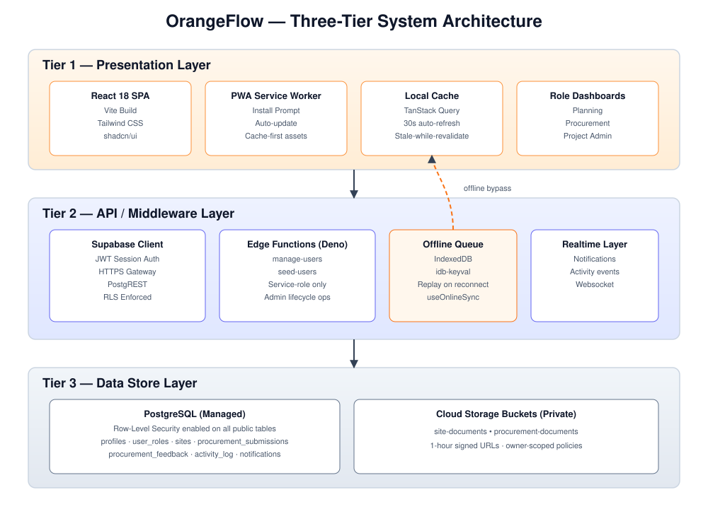
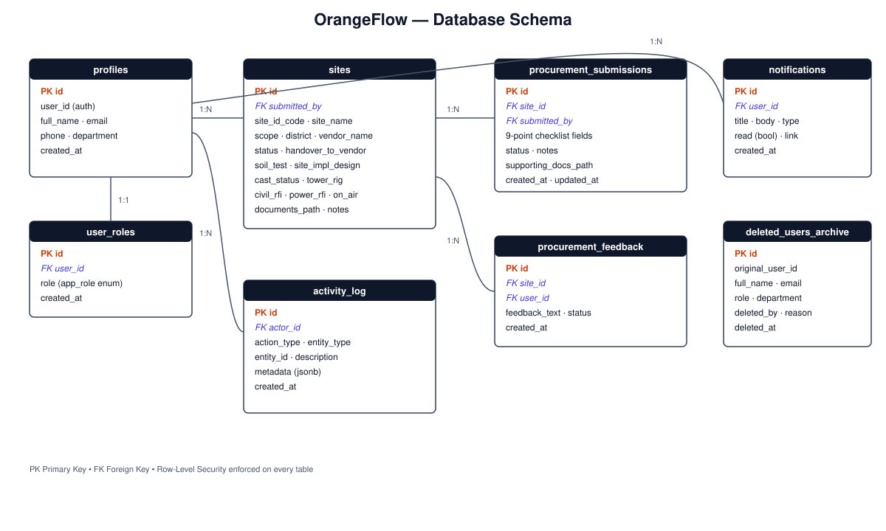
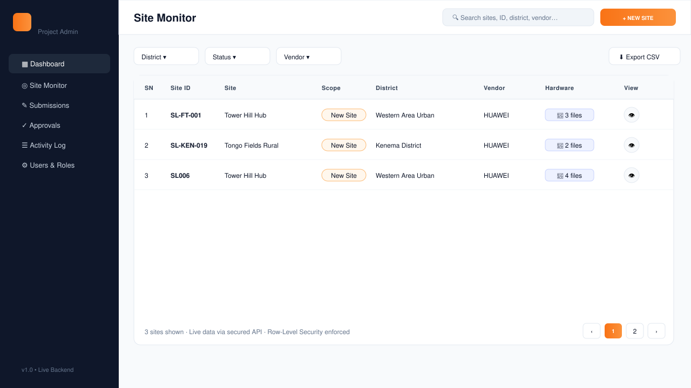

# CHAPTER THREE — RESEARCH METHODOLOGY

> Diagram references below point to the SVG files generated in the project root.

## 3.1 Introduction
This chapter presents the methodology used to design and implement **OrangeFlow**, a role-based, mobile-first Progressive Web Application for centralising the Base Transceiver Station (BTS) site workflow.

## 3.2 Research Design
Applied, design-science research combining descriptive, constructive and evaluative components against the actual OrangeFlow implementation.

## 3.3 Data Collection Methods
Process observation, document review, requirements elicitation and iterative implementation feedback.

## 3.4 Analysis of the Existing System
Manual, paper-driven workflow with fragmented handover, no audit trail, no role-based access, and no offline support.

## 3.5 Proposed System (OrangeFlow)
A three-tier, RLS-secured PWA serving three roles: **Planning Team**, **Procurement Team** and **Project Admin**.

## 3.6 Functional Requirements
Authentication, role assignment, site submission, procurement checklist, approval workflow, offline sync, notifications, activity logging and user management.

## 3.7 Non-Functional Requirements
Security (RLS, private buckets, Edge Functions), usability (mobile-first, no horizontal scroll), availability (PWA + offline), performance (30 s auto-refresh), maintainability (TypeScript), auditability, data integrity.

## 3.8 System Architecture

Three-tier design: React 18 + Vite PWA (Presentation) → Supabase JWT/PostgREST + Deno Edge Functions with IndexedDB offline queue (Middleware) → PostgreSQL with Row-Level Security and private storage buckets `site-documents`, `procurement-documents` (Data).

## 3.9 Database Design

Normalised schema covering `profiles`, `user_roles`, `sites`, `procurement_submissions`, `procurement_feedback`, `activity_log`, `notifications`, and `deleted_users_archive`, each protected by RLS policies.

## 3.10 Use Case Diagram

Captures the three actors and their permitted operations across authentication, submission, review, approval and administration.

## 3.11 Activity Diagram

Swimlane view of the end-to-end request lifecycle across Planning, Procurement and Project Admin lanes.

## 3.12 System Flowchart

Runtime flow: session check → role dashboard → action → online/offline branch → direct API mutation or IndexedDB queue replay.

## 3.13 Entity Relationship Diagram

Crow's-foot ERD showing PK/FK links between the seven operational tables.

## 3.14 Software Development Methodology
Iterative, agile-inspired workflow with continuous integration into the live Lovable Cloud backend.

## 3.15 Technologies Used
React 18, Vite, TypeScript, Tailwind CSS, shadcn/ui, TanStack Query, PWA service worker, `idb-keyval`, Supabase (PostgreSQL, Auth, Storage, Edge Functions).

## 3.16 Testing Strategy
Static analysis (TypeScript, ESLint), Vitest unit tests, manual role-based end-to-end testing, security migrations, offline/PWA testing and responsive testing.

## 3.17 Chapter Summary
The chapter documented the methodology, requirements and architectural design that underpin the OrangeFlow implementation, referencing the generated SVG diagrams stored alongside this document.
