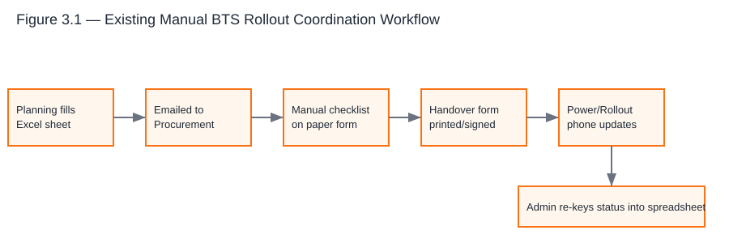
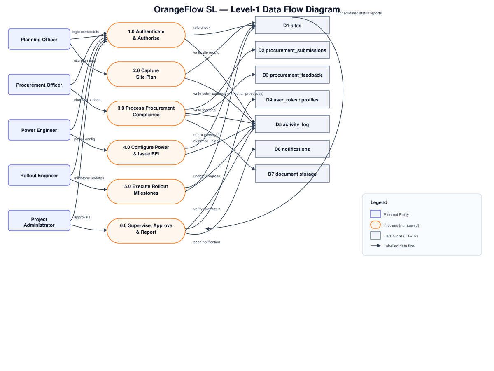
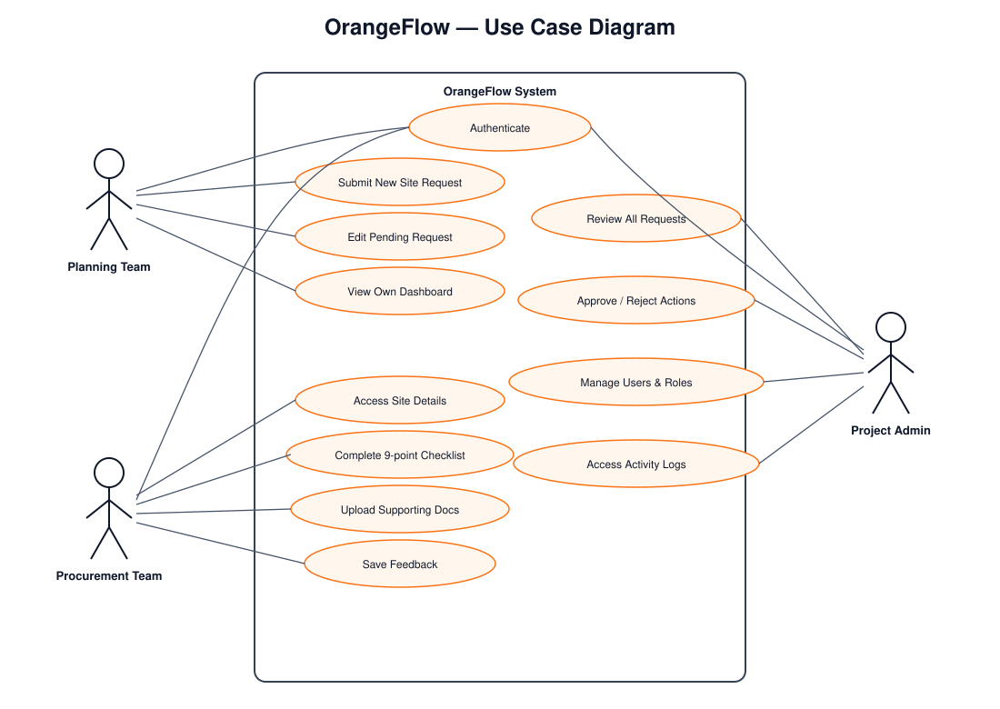
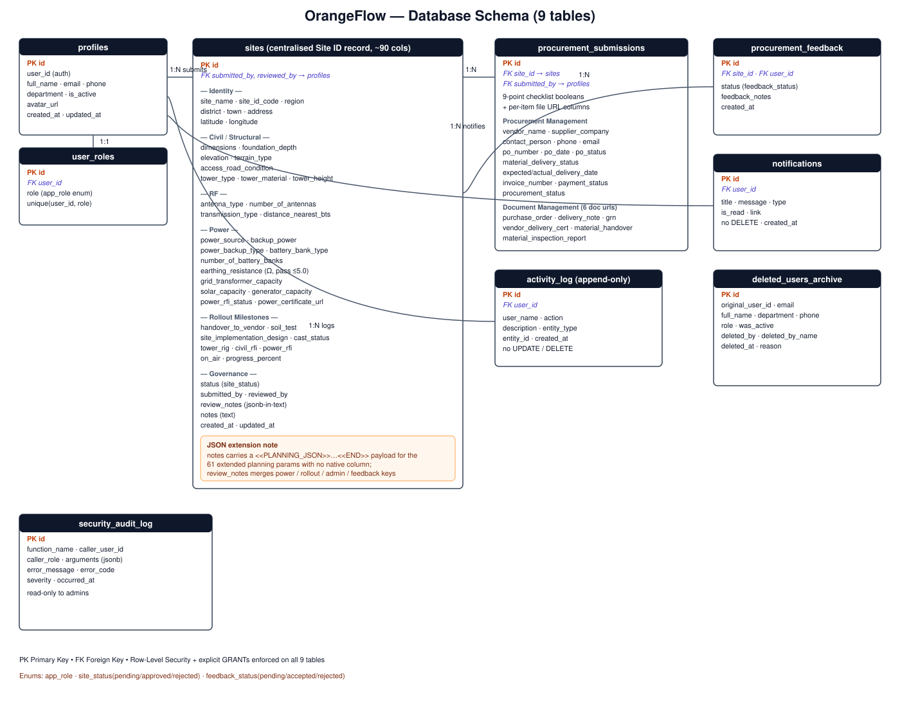
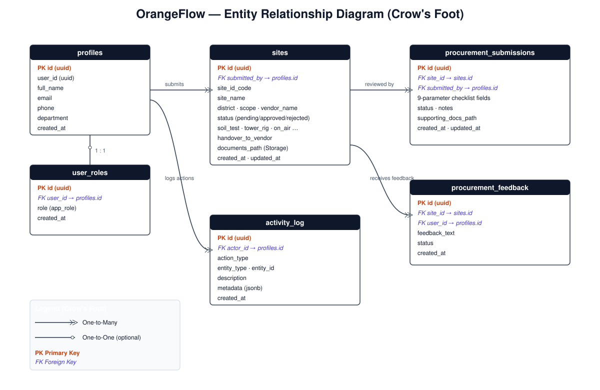
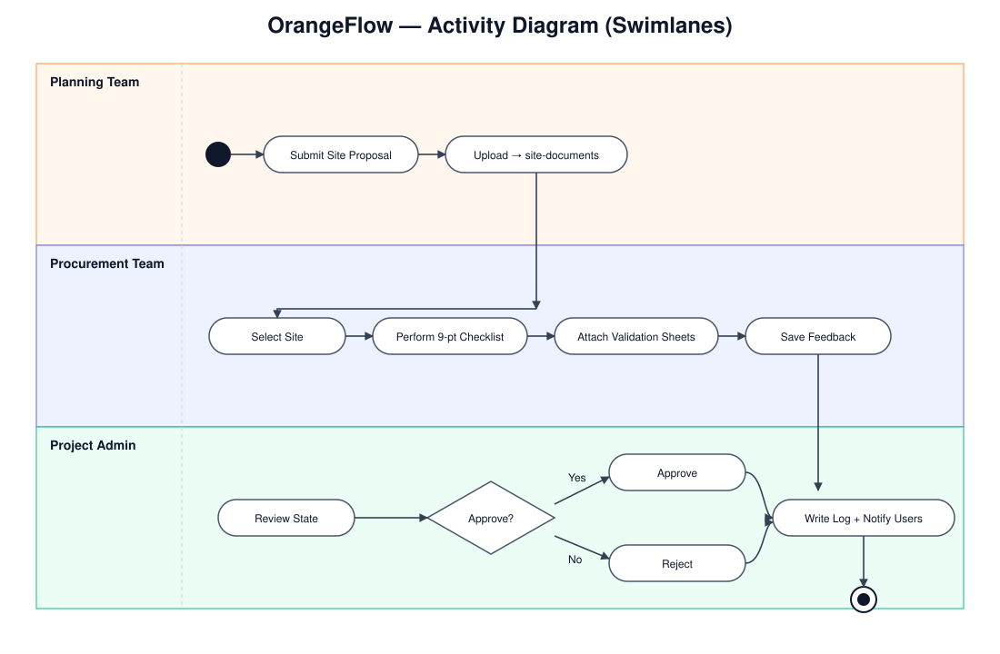
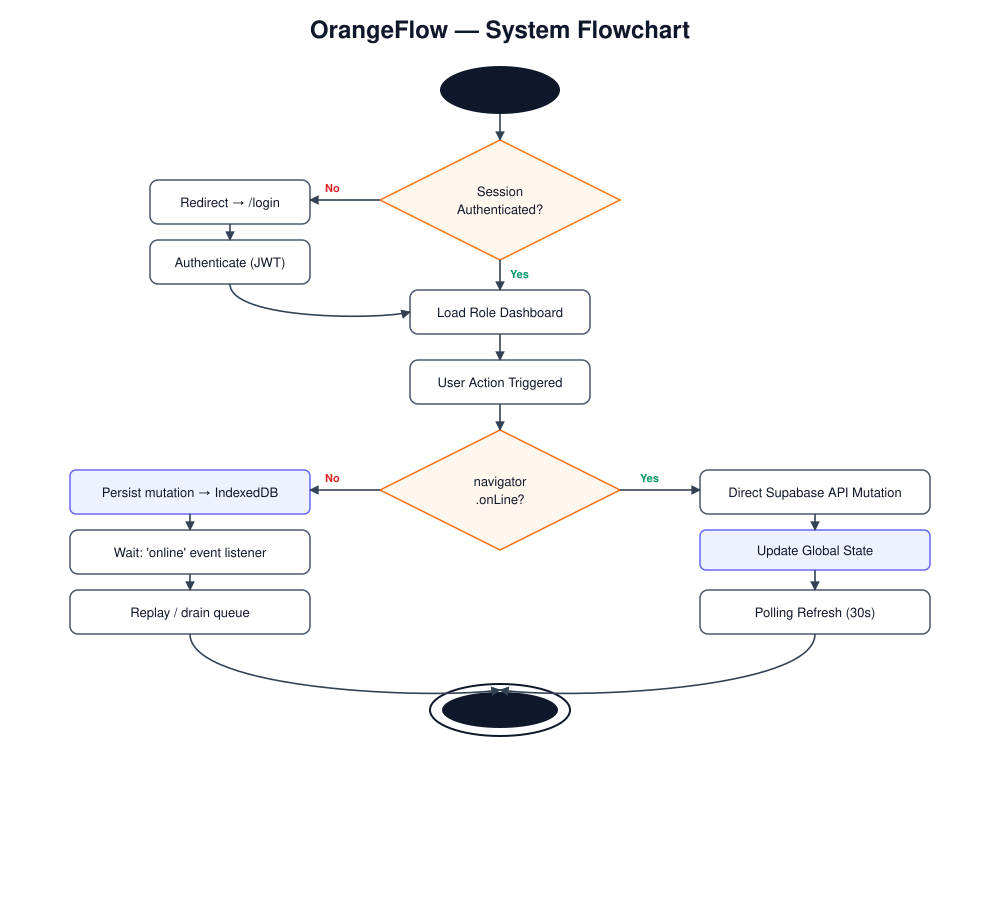
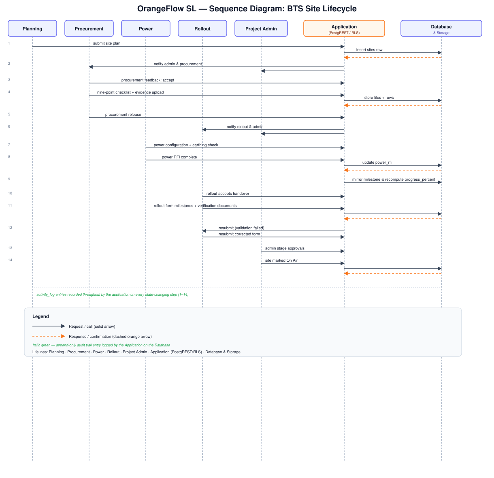

# Chapter Three — System Analysis and Design

## 3.1 Introduction

This chapter presents the analysis of the problem domain and the design of OrangeFlow SL, a web-based and installable Progressive Web Application (PWA) developed to digitise the end-to-end lifecycle of Base Transceiver Station (BTS) site rollout for a Sierra Leonean mobile network operator. The chapter moves systematically from the research and design approach adopted, through requirements elicitation, analysis of the existing manual system, and the specification of functional and non-functional requirements, to the architectural, data, security and interface design decisions that underpin the implementation described in Chapter Four. Diagrams are used extensively — architecture, data flow, use case, entity relationship, database schema, activity, flowchart and sequence representations — so that the rationale for each design decision is traceable to a specific business need identified during elicitation. The chapter closes with a justification of the iterative, incremental development methodology employed and a summary of the technology stack selected for implementation.

## 3.2 Research and Design Approach

The design of OrangeFlow SL was informed by the design-science research (DSR) paradigm, in which an artefact — in this case a software system — is iteratively constructed and evaluated against requirements drawn from a real organisational problem (Hevner et al., 2004; Peffers et al., 2007). Under this paradigm, the researcher alternates between *problem understanding* (through elicitation and analysis of the existing manual coordination process) and *artefact construction* (through incremental prototyping of dashboards, database schema and workflow logic), with each cycle evaluated against stakeholder feedback before proceeding to the next increment. This approach was preferred over a purely descriptive or purely theoretical study because the dissertation's central contribution is a working system whose utility must be demonstrated empirically rather than merely argued for.

The research approach combined qualitative elicitation techniques (interviews, document analysis, observation) with a constructive, engineering design process (requirements specification, architectural modelling, database normalisation, security hardening and interface prototyping) consistent with standard software engineering lifecycles (Sommerville, 2016). Design decisions were validated not only against stated stakeholder requirements but against recognised software quality frameworks, notably ISO/IEC 25010 (2011) for non-functional requirements, and against established security engineering principles such as least privilege and defence in depth (Saltzer and Schroeder, 1975).

## 3.3 Requirements Elicitation and Data Collection

### 3.3.1 Elicitation techniques

Requirements were elicited through four complementary techniques, selected to triangulate findings and reduce the risk of an incomplete or biased requirements set (Sommerville, 2016; Wiegers and Beatty, 2013):

1. **Semi-structured interviews with domain leads.** Interviews were conducted with representative leads from each functional area involved in BTS rollout: a Planning engineer responsible for pre-construction site parameters, a Procurement officer responsible for land and vendor administration, a Power engineer responsible for energy system configuration, a Rollout/civil-works coordinator, and a Project/Admin supervisor with cross-departmental oversight. Each interview followed a loose interview guide covering current responsibilities, the artefacts currently produced or consumed, pain points in coordinating with other departments, and desired improvements, while allowing follow-up questions to pursue unexpected but relevant detail.

2. **Document and artefact analysis.** Existing coordination artefacts were collected and examined, including the Excel-based site-parameter template used by Planning engineers, paper-based nine-point land/vendor checklists used by Procurement, handover sign-off forms exchanged between Procurement and Rollout, and ad hoc spreadsheets used by the Project team to consolidate status across departments. Analysis of these artefacts established the concrete data fields, validation rules and approval semantics that the digitised system would need to reproduce or improve upon.

3. **Observation of field operations.** Where feasible, the researcher observed how field status updates (for example, power certification and civil works milestones) were communicated back to the office — principally by telephone call or messaging — to characterise the latency and error-proneness of the informal reporting channel described in Section 3.4.

4. **Iterative prototype walkthroughs.** As successive increments of the system were built, domain leads were invited to walk through the corresponding dashboard (Planning, Procurement, Power, Rollout, Admin) with representative data, commenting on field completeness, workflow ordering and terminology. Feedback from these sessions was fed back into the requirements set and, where appropriate, into schema or interface revisions before the next increment began, in keeping with the design-science evaluation cycle described in Section 3.2.

### 3.3.2 Participants and sampling

Given that BTS rollout coordination within the operator involves a small number of specialist staff per department rather than a large user population, a purposive sampling strategy was adopted (Patton, 2002): one to two informants per functional area were selected on the basis of their direct, hands-on responsibility for the artefacts and decisions being digitised, rather than by random sampling from a large pool. This yielded five informant groups corresponding to the five roles later formalised in the system: Planning, Procurement, Power, Rollout and Project/Admin. While the sample size is small in absolute terms, it is appropriate for a bounded, specialist business process of this kind, and is consistent with recommended practice for requirements elicitation in narrow, expert domains (Wiegers and Beatty, 2013).

### 3.3.3 Requirements validation

Elicited requirements were validated through three mechanisms. First, requirements derived from interviews were cross-checked against the document analysis findings to confirm that stated needs matched the fields and rules actually present in existing artefacts. Second, a requirements traceability approach was used whereby each functional requirement recorded in Table 3.2 was traced to at least one interview statement, artefact field, or observed operational gap. Third, prototype walkthroughs served as a form of acceptance validation: informants were asked to confirm, against live dashboard prototypes, that the digitised fields, checklists and approval steps faithfully represented their department's responsibilities, and any discrepancies were logged and resolved before the requirement was considered closed.

## 3.4 Analysis of the Existing System

Prior to OrangeFlow SL, BTS rollout coordination at the operator was conducted through a loose combination of spreadsheets, printed forms and verbal communication, illustrated in Figure 3.1.

**Figure 3.1 — Existing Manual BTS Rollout Coordination Workflow**

In this arrangement, a Planning engineer populated an Excel workbook with site parameters and emailed it to Procurement. Procurement staff manually transcribed the nine-point land and vendor checklist onto a paper form, which was later re-entered, often incompletely, into a separate tracking spreadsheet. Handover to the Rollout/civil-works team was confirmed by a printed and signed handover form rather than a system-enforced state transition. Power and Rollout field staff reported milestone completion — such as earthing resistance measurements or tower rigging completion — by telephone, with office staff manually updating a master spreadsheet on their behalf. Finally, the Project/Admin team re-keyed status information from all of these sources into a consolidated spreadsheet for reporting purposes.

Analysis of this workflow revealed the following structural weaknesses:

- **No single source of truth.** Each department maintained its own copy of site data, so authoritative status (for example, whether a site had been approved) could diverge between the Planning spreadsheet, the Procurement tracker and the Project consolidation sheet.
- **Manual re-entry and transcription error.** Data crossed departmental boundaries through re-typing rather than through a shared record, introducing transcription errors and delay, particularly for the nine-point Procurement checklist and the seven-item Rollout milestone list.
- **No enforced approval sequencing.** Nothing technically prevented, for example, a Power team update being actioned on a site that Procurement had rejected, because there was no shared status field with access control.
- **Weak audit trail.** Verbal status updates left no durable record of who reported what, and when, complicating accountability when milestones were later disputed.
- **No document custody control.** Supporting documents (land ownership evidence, vendor contracts, certification PDFs) were exchanged as e-mail attachments or paper copies, with no consistent access restriction between departments that should, and should not, be able to view commercially sensitive documents.
- **Delayed visibility.** Because status changes were not visible to other departments until manually re-communicated, the Project/Admin team's oversight was necessarily retrospective and periodic (typically weekly), rather than real time.

These weaknesses directly motivated the requirements captured in Sections 3.6–3.8 and the architectural decisions in Section 3.9, most notably the adoption of a single centralised `sites` record (Section 3.17), role-based write access enforced at the database layer, and a real-time notification mechanism connecting departments as work progresses.

## 3.5 The Proposed System

OrangeFlow SL replaces the artefact-mediated workflow of Section 3.4 with a single web application, installable as a Progressive Web Application, in which every department interacts with the same underlying `sites` record through a dedicated, role-specific dashboard: Planning, Procurement, Power, Rollout and Project/Admin. Rather than exchanging spreadsheets and paper forms, each department reads and writes directly to shared database tables governed by row-level security policies, so that status changes made by one department are immediately visible — and, through a real-time channel and workflow notifications, actively surfaced — to the departments that depend on them. The nine-point Procurement checklist, the seven-item Rollout milestone list, and the Power configuration and certification fields identified during document analysis (Section 3.3) are reproduced as first-class, validated form fields rather than free-text entries, and every supporting document is uploaded to access-controlled private storage rather than circulated informally. The Project/Admin team retains global oversight and approval authority but now exercises it through live dashboards (Site Monitor, stage review screens, activity log) rather than a manually reconstructed spreadsheet. The system additionally provides offline resilience for field conditions with intermittent connectivity, discussed in Section 3.9, and an audit trail sufficient to reconstruct the provenance of every stage decision, discussed in Section 3.18.

## 3.6 Role Analysis and Permission Model

OrangeFlow SL implements five mutually exclusive operational roles, each mapped to its own dashboard route: `planning_team` (`/planning`), `procurement_team` (`/procurement`), `power_team` (`/power`), `rollout_team` (`/rollout`) and `project_team` (`/admin`), the last of which carries global administrative authority. Roles are assigned per user account and are not mutually derivable from one another in the application logic; a user's authority is determined solely by the role(s) recorded for their account.

The route guard component (`AuthGuard`) inspects the authenticated user's role immediately after sign-in and redirects them to the dashboard appropriate to that role; a user attempting to navigate directly to a route outside their assigned role (for example, a Procurement user requesting `/power`) is redirected away from that route rather than being shown its content, so that unauthorised functionality is not merely hidden by the interface but is structurally unreachable. This mechanism operationalises the principle of least privilege (Saltzer and Schroeder, 1975): each role is granted only the access necessary to perform its function, and no role is permitted, by default, to act outside its own operational boundary.

A design decision of particular architectural importance is that role must be enforceable at the point of *deletion and modification of data*, not merely at the point of routing. Planning staff, for instance, are permitted to create and edit their own pending site submissions, since site parameters are frequently revised before Procurement handover, but they are explicitly *not* permitted to delete a site record once created; deletion is reserved exclusively to the Project/Admin team. This asymmetry — full read/write for Planning short of deletion, full authority including deletion for Project/Admin — reflects the organisational reality that a site record, once created, becomes a shared asset referenced by other departments, so its removal must be a deliberate, centrally authorised act rather than a routine editing operation.

To make this rule robust against both application bugs and malicious clients, roles are not stored on the user's profile record or embedded in a client-readable token claim that the application itself controls; instead they are held in an entirely separate `user_roles` table, keyed by user ID and role, and all authorisation checks — both in row-level security (RLS) policies and in server-side logic — are mediated through a `SECURITY DEFINER` function, `has_role(_user_id, _role)`, executed with elevated database privileges rather than the calling user's own privileges. This separation serves two purposes recommended in secure database design practice (Bertino and Sandhu, 2005; PostgreSQL Global Development Group, 2023). First, it prevents *privilege escalation*, because a row-level security policy that referenced a role column stored on a table users can otherwise write to (such as a mutable profile table) would allow a malicious or compromised client to grant itself elevated privileges by editing that column; keeping roles in a distinct table with its own restrictive policies removes this vector. Second, it prevents *recursive policy evaluation*, a known PostgreSQL RLS pitfall in which a policy on table X that queries table X to determine access can produce infinite recursion or non-terminating query plans; wrapping the role check in a `SECURITY DEFINER` function that queries `user_roles` directly, outside the calling user's own RLS context, avoids this recursion entirely while still enforcing the same access rule.

Table 3.1 summarises the resulting permission matrix across the five roles and the principal record types and administrative capabilities in the system.

**Table 3.1 — Role–Permission Matrix**

| Capability | Planning | Procurement | Power | Rollout | Project (Admin) |
|---|---|---|---|---|---|
| Create Site | Yes | No | No | No | Yes |
| View Site | Own + assigned | All non-rejected | All non-rejected | All non-rejected | All |
| Edit Site | Own, pending only | Own submissions | Non-rejected sites | Non-rejected sites | All |
| Delete Site | **No** | No | No | No | **Yes (sole role)** |
| Procurement records (create/edit) | No | Yes | View only | View (readiness/status only) | Review/approve |
| Power records (create/edit) | No | View only | Yes | No | Review/approve |
| Rollout records (create/edit) | No | No | View only | Yes | Review/approve |
| Approve stage | No | No | No | No | Yes |
| Manage users | No | No | No | No | Yes |
| View audit log | No | No | No | No | Yes |

## 3.7 Functional Requirements

The functional requirements set out in Table 3.2 was derived directly from the elicitation activities of Section 3.3 and grouped by the module of the system to which each requirement primarily relates. Priority follows the MoSCoW convention (Must, Should, Could) (Clegg and Barker, 1994), with all "Must" requirements delivered in the implementation described in Chapter Four.

**Table 3.2 — Functional Requirements**

| ID | Module | Description | Priority |
|---|---|---|---|
| FR-01 | Authentication | The system shall authenticate users via email and password and issue a session token (JWT). | Must |
| FR-02 | Authentication | The system shall redirect an authenticated user to the dashboard matching their assigned role. | Must |
| FR-03 | Authentication | The system shall prevent access to a route not associated with the authenticated user's role. | Must |
| FR-04 | Planning | The system shall allow Planning users to create a new site record with identity, civil, RF and technology-classification fields. | Must |
| FR-05 | Planning | The system shall organise site parameters into logical accordion modules, rendering 2G/3G/4G radio network fields conditionally on selected technology. | Must |
| FR-06 | Planning | The system shall allow bulk import of site parameters from an Excel workbook, mapping known field aliases automatically. | Must |
| FR-07 | Planning | The system shall detect network technology (2G/3G/4G) from imported workbook content where not explicitly stated. | Should |
| FR-08 | Planning | The system shall persist extended planning parameters lacking a native column within a structured, machine-parsable segment of the site's notes field, without corrupting human-readable remarks. | Must |
| FR-09 | Planning | The system shall allow Planning users to save an incomplete submission as a draft. | Should |
| FR-10 | Planning | The system shall validate submitted data against an expected schema before acceptance. | Must |
| FR-11 | Planning | The system shall permit Planning users to edit only their own pending submissions and shall not offer a delete action. | Must |
| FR-12 | Procurement | The system shall allow Procurement users to accept or reject a Planning handover, requiring mandatory notes on rejection. | Must |
| FR-13 | Procurement | The system shall present a nine-point checklist across Land Acquisition, Land Lease and Handover categories, each item independently completable. | Must |
| FR-14 | Procurement | The system shall allow a supporting document to be attached to each checklist item. | Must |
| FR-15 | Procurement | The system shall capture vendor/supplier details, purchase order data, delivery status and payment status. | Must |
| FR-16 | Procurement | The system shall allow upload of Purchase Order, Delivery Note, GRN, Vendor Delivery Certificate, Material Handover Form and Material Inspection Report documents. | Must |
| FR-17 | Procurement | The system shall notify both the Project team and the Rollout team upon Procurement submission. | Must |
| FR-18 | Power | The system shall list every site with a non-rejected Planning submission as eligible for Power configuration. | Must |
| FR-19 | Power | The system shall capture primary, generator, renewable and backup power configuration parameters. | Must |
| FR-20 | Power | The system shall validate earthing resistance against a 5.0 ohm threshold and visually flag non-compliant values. | Must |
| FR-21 | Power | The system shall capture Power RFI status and certification documents. | Must |
| FR-22 | Power | The system shall mirror Power RFI status into the site's rollout milestone data and trigger recalculation of overall progress percentage. | Must |
| FR-23 | Power | The system shall refresh Power dashboard data automatically upon relevant database changes without requiring manual reload. | Should |
| FR-24 | Rollout | The system shall allow Rollout users to accept or reject a Procurement handover. | Must |
| FR-25 | Rollout | Upon acceptance of a handover, the system shall automatically present the corresponding Rollout Form for the accepted site. | Should |
| FR-26 | Rollout | The system shall present Procurement readiness summarised by category, with document access restricted according to document sensitivity. | Must |
| FR-27 | Rollout | The system shall capture project information, seven deployment milestones, seven execution dates and site verification documents. | Must |
| FR-28 | Rollout | The system shall compute and display a live progress bar derived from completed milestones. | Must |
| FR-29 | Rollout | The system shall allow re-submission of a previously submitted Rollout form and shall record submission count and timestamp metadata. | Should |
| FR-30 | Admin | The system shall provide an aggregate overview of total sites, pending items, users and procurement backlog. | Must |
| FR-31 | Admin | The system shall allow the Project team to approve or request revisions to Planning, Power and Rollout stage submissions with mandatory feedback text on revision requests. | Must |
| FR-32 | Admin | The system shall provide a dense, sortable Site Monitor table exposing key attributes across all modules. | Must |
| FR-33 | Admin | The system shall allow the Project team to create, edit, deactivate and delete user accounts, archiving deleted accounts for audit purposes. | Must |
| FR-34 | Admin | The system shall present a chronological, immutable activity log of significant actions across the system. | Must |
| FR-35 | Cross-cutting | The system shall send in-application notifications to relevant roles when a stage transition occurs. | Must |
| FR-36 | Cross-cutting | The system shall remain fully operable for permitted data capture when the device is offline, durably storing submissions and their attached files locally and synchronising them automatically when connectivity returns, without loss or duplication. | Must |
| FR-36a | Cross-cutting | The system shall detect a conflicting central modification of a record edited offline and flag it for review rather than overwriting it silently. | Must |
| FR-36b | Cross-cutting | The system shall display the synchronisation state of offline submissions (offline, pending, synchronising, synchronised, failed, conflict) to the user. | Must |
| FR-37 | Cross-cutting | The system shall be installable on desktop and mobile devices as a Progressive Web Application. | Could |

## 3.8 Non-Functional Requirements

Non-functional requirements were derived from operational concerns raised during elicitation (in particular, field connectivity, data sensitivity, and the desire for a system usable on modest field devices) and are expressed in Table 3.3 against the eight quality characteristics of ISO/IEC 25010 (2011), with measurable acceptance criteria in each case.

**Table 3.3 — Non-Functional Requirements**

| ID | ISO/IEC 25010 Characteristic | Requirement | Acceptance Criterion |
|---|---|---|---|
| NFR-01 | Functional Suitability | The system shall reproduce all fields of the existing nine-point Procurement checklist without omission. | 9/9 checklist items present and independently persistable. |
| NFR-02 | Performance Efficiency | Dashboard data shall refresh automatically at a bounded interval to maintain currency without excessive load. | Automatic refetch interval of 30 seconds, with immediate refetch on window focus/reconnect. |
| NFR-03 | Performance Efficiency | Cached query results shall be considered fresh for a short, bounded window to avoid redundant network calls. | Stale time of 10 seconds; up to 3 automatic retries on transient failure. |
| NFR-04 | Compatibility | The application shall render correctly on common desktop and mobile browsers without horizontal scrolling on mobile. | Verified on target viewport widths down to 360px with no horizontal overflow. |
| NFR-05 | Usability | Field users shall be able to install the application to a home screen and operate it without prior training beyond a short walkthrough. | Custom install prompt with iOS fallback instructions available on all supported platforms. |
| NFR-06 | Reliability | The application shall remain operable, for previously loaded data and for new data capture, during a loss of network connectivity, and shall not lose queued work when the browser is closed. | All domain forms, document uploads and Excel uploads usable offline; submissions and file blobs persisted in IndexedDB and replayed automatically on reconnection, matched by Site ID to prevent duplication. |
| NFR-07 | Reliability | Data updates from one department shall be visible to dependent departments without manual refresh. | Real-time propagation via publish/subscribe channel on the `sites` and `procurement_submissions` tables. |
| NFR-08 | Security | All data tables shall deny access by default and grant access only via explicit, role-aware policy. | Row-level security enabled with explicit GRANTs on every application table; no table publicly writable. |
| NFR-09 | Security | Uploaded documents shall not be retrievable via a permanent public URL. | All storage buckets private; access exclusively via time-limited (1-hour) signed URLs. |
| NFR-10 | Security | A user shall not be able to grant themselves an elevated role. | Self-escalation prevention trigger rejects role changes initiated by the affected user for their own account. |
| NFR-11 | Maintainability | The system shall be structured into independently testable modules aligned to organisational roles. | Each dashboard implemented as an isolated component with its own data-access boundary. |
| NFR-12 | Maintainability | Database schema changes shall be applied through versioned, reviewable migration scripts. | All schema changes captured in sequentially numbered SQL migrations. |
| NFR-13 | Portability | The system shall be deployable without modification to any standards-compliant HTTPS hosting environment. | Deployed to a custom domain over HTTPS with no environment-specific hard-coded endpoints. |
| NFR-14 | Security | Weak or previously compromised passwords shall be rejected at account creation and password change. | Leaked-password protection enabled at the authentication layer. |

## 3.9 System Architecture

OrangeFlow SL follows a three-tier architecture separating presentation, application/middleware and data concerns, illustrated in Figure 3.2.

**Figure 3.2 — Three-Tier System Architecture**

The **Presentation tier** comprises a React single-page application delivered as an installable Progressive Web Application. A service worker, generated by a Workbox-based build plugin, provides offline asset caching and update management, while a client-side query cache (TanStack Query) maintains and automatically revalidates server data used by the interface. Within this tier, five distinct role-oriented dashboards — Planning, Procurement, Power, Rollout and Project/Admin — present only the views, forms and actions relevant to the authenticated user's role, consistent with the permission model of Section 3.6.

The **API/Middleware tier** mediates all access to persisted data. An authenticated client attaches a JSON Web Token (JWT), issued at sign-in, to every request. Standard CRUD operations are served through an auto-generated RESTful interface (PostgREST) whose every query is filtered through row-level security policies evaluated against the caller's identity and role, so that authorisation is enforced at the database boundary rather than solely in client code. Operations requiring elevated, non-row-scoped privilege — principally user lifecycle management — are handled by dedicated serverless Deno Edge Functions executing with service-role credentials, callable only by the Project team. This tier additionally hosts an offline action queue, persisted in the browser's IndexedDB store, which buffers writes made while offline and replays them once connectivity is restored, and a real-time channel that pushes row-change notifications from the data tier back to subscribed dashboards.

The **Data tier** is a managed PostgreSQL database in which every table has row-level security enabled together with explicit privilege grants, and a private object storage service holding uploaded documents behind access-controlled buckets. This tier is discussed in detail in Sections 3.12–3.13 and 3.18.

## 3.10 Data Flow Design

Figure 3.3 presents a Level-1 data flow diagram tracing site data as it moves between the five external entities (the four departmental roles and the Project/Admin role) and the principal data stores of the system.

**Figure 3.3 — Level-1 Data Flow Diagram**

The diagram formalises the workflow narrated in Section 3.5: Planning submits a site plan into the `sites` data store (Process 1.0); Procurement reads that record and writes its checklist and management data into the `procurement_submissions` store (Process 2.0), while its acceptance/rejection decision is written to `procurement_feedback`; Power reads procurement status and writes power configuration back onto the `sites` record (Process 3.0); Rollout reads procurement readiness and writes milestone, schedule and document data back onto the `sites` record (Process 4.0); and Project/Admin approval (Process 5.0) reads across all preceding stores and writes stage-approval outcomes back into `sites.review_notes`, closing the loop described in Section 3.17. Every process that produces a state change additionally writes an entry to the `activity_log` store and, where cross-role attention is required, triggers a record in the `notifications` store, ensuring that the audit and alerting mechanisms described in Section 3.18 are populated consistently regardless of which process initiated the change.

## 3.11 Use Case Design

Figure 3.4 presents the use case diagram for OrangeFlow SL, showing the five role actors and their principal interactions with the system.

**Figure 3.4 — Use Case Diagram**

The Planning actor's use cases include *Create Site Record*, *Import from Excel*, *Save Draft*, *Validate Schema* and *Edit Pending Submission*; notably, *Delete Site* is not a use case available to this actor, consistent with Table 3.1. The Procurement actor's use cases include *Review Planning Handover*, *Complete Checklist Item*, *Upload Supporting Document*, and *Record Procurement Management Data*. The Power actor's use cases include *Configure Power System*, *Record Power RFI* and *Upload Certification*. The Rollout actor's use cases include *Accept Procurement Handover*, *View Procurement Readiness*, *Record Milestones* and *Upload Verification Documents*. The Project/Admin actor is associated, via generalisation, with an oversight use case *Approve Stage*, together with *Manage Users*, *View Site Monitor* and *View Activity Log*, and is the sole actor associated with *Delete Site*. Several use cases — notably checklist completion, milestone recording and stage approval — include an `<<extend>>` relationship to a shared *Send Workflow Notification* use case, reflecting the cross-cutting notification requirement (FR-35).

## 3.12 Database Design

The database schema was designed around a single, wide `sites` table acting as the centralised record for a BTS site throughout its lifecycle (see Section 3.17), supplemented by satellite tables that hold department-specific submissions, feedback, and cross-cutting audit and notification data. Figure 3.6 shows the resulting schema.

**Figure 3.6 — Database Schema**

### 3.12.1 The centralised `sites` table

The `sites` table consolidates approximately ninety columns spanning site identity and location (name, site ID code, region, district, town, address, coordinates), civil and structural attributes (dimensions, foundation depth, elevation, terrain type, access road condition, tower type/material/height), radio-frequency attributes (antenna type and count, transmission type, distance to nearest BTS), power attributes (power source, backup type, battery configuration, earthing resistance, transformer/solar/generator capacity, Power RFI status, certificate reference), rollout milestone flags and a computed progress percentage, and governance fields (status, submitter, reviewer, review notes, free-text notes, approval metadata and timestamps). Consolidating these attributes into one record, rather than distributing them across per-department tables joined only loosely, is what allows every dashboard to present a coherent, current view of a site regardless of which department last updated it.

### 3.12.2 JSON extension strategy

Two extension mechanisms allow the schema to accommodate data that does not warrant a dedicated column, without resorting to unstructured free text that would be unusable by downstream consumers.

First, the Planning module collects sixty-one parameters, a number of which have no corresponding native column because they apply only to specific radio technologies or represent detailed engineering sub-parameters. These extended parameters are serialised as a JSON payload and embedded within the `notes` column behind a literal sentinel marker, `<<PLANNING_JSON>>`, terminated by an `<<END>>` marker. A dedicated parsing helper separates the human-readable planner remark, which precedes the sentinel, from the machine-readable payload, which follows it, so that every downstream viewer — Procurement, Power, Rollout, Admin and the Site Monitor table — renders only the clean prose remark to end users while the structured payload remains available to any component that needs to reconstruct the full parameter set. This design avoids a disruptive schema migration for every new Planning parameter while preserving strict separation between human commentary and structured data.

Second, stage-specific review outcomes produced by Power, Rollout, Admin approval and Procurement feedback are stored as a single merged JSON object in the `sites.review_notes` column, keyed by stage: `power`, `rollout`, `admin` and `feedback`. Because more than one stage may need to write to this column over the life of a site, and because stages proceed asynchronously and out of strict sequence in practice, writes to `review_notes` follow a strict **merge-not-overwrite** rule: before writing, the existing JSON object is read and only the key belonging to the writing stage is replaced, with all other keys preserved unchanged. This prevents, for example, a later Rollout update from silently erasing Power's previously recorded review notes, a failure mode that would otherwise be likely given that all four stages share a single column.

### 3.12.3 Satellite tables

Table 3.4 summarises every table in the schema, its purpose, its principal columns, and the row-level security posture applied to it.

**Table 3.4 — Database Tables Summary**

| Table | Purpose | Key Columns | RLS Summary |
|---|---|---|---|
| `profiles` | Extended user profile information created on signup. | user_id, full_name, email, department, is_active | Users may view/edit own profile; Project team may view/manage all. |
| `user_roles` | Authoritative store of role assignment, separate from profile data. | user_id, role | Insert/update restricted to Project team via `manage-users`; readable via `has_role()`; self-escalation blocked by trigger. |
| `sites` | Centralised Site ID record spanning the full rollout lifecycle. | id, site_id_code, status, review_notes, progress_percent | Planning may insert/select/update own pending rows; Power/Rollout may update non-rejected rows; only Project team may delete. |
| `procurement_submissions` | Nine-point checklist plus procurement management and document data, per site. | site_id, checklist booleans, po_number, procurement_status | Procurement team full CRUD on own submissions; other roles read-only per scope; Project team full access. |
| `procurement_feedback` | Procurement's accept/reject decision on a Planning handover. | site_id, user_id, status, feedback_notes | Insert by Procurement; readable by Planning, Rollout, Project. |
| `activity_log` | Append-only audit trail of significant actions. | user_id, action, entity_type, entity_id, created_at | Insert-only for authenticated actions; no UPDATE/DELETE permitted to any role; read restricted to Project team. |
| `notifications` | Per-user, in-application alerts. | user_id, title, message, type, is_read, link | Insert restricted to `auth.uid() = user_id` or via `send_workflow_notification`; no DELETE. |
| `deleted_users_archive` | Historical record of deleted user accounts, for accountability. | original_user_id, deleted_by, reason, deleted_at | Insert by `manage-users` Edge Function only; read restricted to Project team. |
| `security_audit_log` | Record of security-relevant function invocations and violations. | function_name, caller_user_id, severity, occurred_at | Insert by SECURITY DEFINER functions only; read-only, restricted to Project team. |

## 3.13 Entity Relationship Design

Figure 3.5 presents the entity relationship diagram underlying the schema described in Section 3.12.

**Figure 3.5 — Entity Relationship Diagram**

`sites` is the central entity, related one-to-many to `procurement_submissions` and `procurement_feedback` (a site may accumulate more than one submission or feedback event over successive resubmissions), and referenced by foreign key from `activity_log` and, indirectly through application logic, from `notifications`, where the `entity_id`/`link` fields reference a given site. `profiles` is related one-to-many to `user_roles`, reflecting that a single user account is associated with role records held in a separate table for the security reasons discussed in Section 3.6, and `profiles` is referenced from `sites` through `submitted_by` and `reviewed_by`, and from `activity_log` and `deleted_users_archive` through their respective user references. `deleted_users_archive` and `security_audit_log` are intentionally not linked by foreign key to live rows, since both must remain intact even after the referenced user account or triggering event no longer exists in its original table, preserving the historical record required for audit purposes.

## 3.14 Activity and Process Design

Figure 3.7 models, as an activity diagram, the cross-departmental decision logic that a site record passes through as it advances from creation to completion.

**Figure 3.7 — Activity Diagram**

The activity flow begins with Planning's creation and submission of a site record, followed by a decision point at Procurement feedback: on rejection, control returns to Planning for revision; on acceptance, the nine-point checklist and procurement management activities proceed in parallel with continued Planning visibility. Completion of procurement release triggers a fork notifying both Power and Rollout, who then proceed largely independently — Power through its three configuration and certification modules, Rollout through handover acceptance and its four-section form — with a join point at Project/Admin stage review, where each stage may be approved or sent back for revision. Only once Planning, Procurement, Power and Rollout stages have each been approved, and the final rollout milestone (On Air) recorded, does the activity terminate in a completed state.

## 3.15 System Flowchart

Figure 3.8 presents the system-level flowchart, describing the control logic exercised by the application at each user interaction, from authentication through role-based routing to the CRUD and workflow operations available within each dashboard.

**Figure 3.8 — System Flowchart**

The flowchart begins at application launch, proceeding to a login/session check; an unauthenticated user is directed to the login screen, while an authenticated user's role is read and used to route them to their dashboard, consistent with the route guard behaviour of Section 3.6. Within each dashboard, the flowchart distinguishes read operations (which are permitted broadly, subject to row-level security scope) from write operations (which are additionally checked against the specific action being attempted — for example, whether the current user's role permits deletion of the record in question) before the corresponding database call is issued and, where relevant, a notification and activity log entry are generated.

## 3.16 Sequence Design of the Site Lifecycle

Figure 3.9 presents a sequence diagram tracing a single BTS site through its complete lifecycle across all five roles and the underlying `sites` data store.

**Figure 3.9 — Sequence Diagram: Site Lifecycle**

The lifecycle begins with **Planning submission**, in which the Planning actor creates a `sites` row with status `pending` and the data store issues a notification to Procurement. **Procurement feedback** follows, in which Procurement records an accept or reject decision in `procurement_feedback`; on acceptance, Procurement proceeds through the **nine-point compliance checklist**, completing the Land Acquisition, Land Lease and Handover items with supporting documents, before recording **procurement release**, at which point the `sites` record is updated and notifications are dispatched to both the Rollout and Power teams, consistent with FR-17.

**Power configuration** then proceeds independently: the Power actor records primary and backup power parameters and raises a **Power RFI** (Request for Inspection), whose status is written both to a Power-specific record and mirrored into the corresponding `sites` rollout milestone field, triggering recalculation of the overall progress percentage (FR-22) and a notification to Rollout and Project/Admin.

In parallel, **rollout handover acceptance** occurs when the Rollout actor accepts the Procurement handover; the interface automatically opens the Rollout Form for that site (FR-25). The Rollout actor then records **milestones** (handover to vendor, soil test, site implementation design, cast status, tower rig, civil RFI, power RFI, and on-air), the associated **execution schedule** dates, and uploads **verification documents** (soil test report, site implementation design, quality certificate, site photographs), each update again propagating a live progress-bar recalculation and a notification to Project/Admin.

Finally, **Project/Admin stage approvals** occur for each of the Planning, Procurement, Power and Rollout stages independently; each approval or revision request is written into the corresponding key of `sites.review_notes` under the merge-not-overwrite rule described in Section 3.12.2, and only once every stage has been approved and the on-air milestone recorded does the site reach its terminal **On Air** state.

## 3.17 Centralised Site ID Architecture

A defining architectural decision of OrangeFlow SL is the use of a single, centralised identifier — the `sites.id` primary key, exposed operationally as `site_id_code` — as the sole join key linking every department's data about a given physical BTS site. Rather than each department maintaining an independent record that must later be reconciled (as occurred under the manual workflow analysed in Section 3.4), Planning, Procurement, Power, Rollout and Project/Admin all read and write against the same `sites` row, supplemented, where department-specific volume warrants a separate table, by satellite tables (`procurement_submissions`, `procurement_feedback`) that are themselves keyed by `site_id` foreign key back to the same centralised record.

This centralisation has three direct architectural consequences. First, it eliminates the possibility of divergent status between departments, since there is exactly one authoritative `status` and one authoritative `progress_percent` value per site, rather than department-local copies. Second, it makes real-time propagation straightforward: because `REPLICA IDENTITY FULL` is enabled together with real-time publication on `sites` and `procurement_submissions`, a change made by any department is broadcast, with full row content, to every subscribed dashboard, allowing TanStack Query caches across all connected clients to be invalidated and refreshed without a manual reload. Third, it necessitated the merge-not-overwrite JSON discipline described in Section 3.12.2 for the `review_notes` column and the stage-scoped row-level security widening noted in Section 3.9 — Power and Rollout teams were originally restricted to updating only `approved` sites, a rule that in practice silently blocked legitimate writes once a site had progressed beyond initial approval, and was corrected to permit updates to any site that is not `rejected`, reflecting the operational reality that Power and Rollout activity legitimately continues throughout the pending-to-on-air lifecycle, not merely after a single upfront approval.

## 3.18 Security Design

Security was treated as a first-order design concern throughout the project, reflecting the sensitivity of commercial vendor data, site coordinates, and user account information handled by the system. The security design rests on the following pillars.

**Row-level security with explicit grants.** Every table in the public schema has row-level security enabled, and, in addition, explicit `GRANT` statements are issued for each role rather than relying on default PostgreSQL privileges, so that a table is inaccessible by default and only becomes accessible through a deliberately authored policy, in line with a default-deny security posture (Saltzer and Schroeder, 1975).

**Separate role table and `has_role()` function.** As described in Section 3.6, roles are held in `user_roles`, a table distinct from user-editable profile data, and every policy that depends on role membership calls the `SECURITY DEFINER` function `has_role(_user_id, _role)` rather than inlining a role lookup, both to prevent privilege escalation through editable columns and to avoid recursive policy evaluation.

**Private storage with signed URL delivery.** Both storage buckets used by the system, `site-documents` and `procurement-documents`, are private; no object is retrievable via a permanent public URL. Access is instead granted through owner- and role-scoped storage policies (for example, Power and Rollout teams are scoped to their own folders, while the Project team has global read access) combined with signed URLs valid for one hour, generated on demand. Because the database stores only the object *path*, not a URL, a compromised or leaked database row cannot itself be used to retrieve a document outside the one-hour signing window. Client-side delivery additionally accounts for browser privacy filtering: certain browser extensions and built-in tracker-blocking features intercept direct navigation to the storage provider's domain, so the client instead fetches the signed URL server-side, converts the response to a binary object, and presents it to the user as a local object URL, with an automatic download fallback if inline preview is not possible.

**Sanitising, access-controlled notification RPC.** Because notifications must sometimes be raised by one user on behalf of another (for example, Procurement notifying the Rollout team), direct `INSERT` privilege on the `notifications` table is restricted to a user inserting a notification for themselves (`auth.uid() = user_id`); all cross-user notification traffic is instead routed through the `send_workflow_notification` remote procedure, which independently verifies the caller's role before proceeding, strips or rejects unsafe message content, and explicitly rejects any link value that resolves to an external (non-relative) address, preventing the notification channel from being used to redirect a user to an external phishing destination.

**Self-escalation prevention.** A dedicated trigger, `prevent_role_self_escalation`, rejects any attempt by a user to alter their own row in `user_roles`, ensuring that role changes can only be made by the Project team acting through the `manage-users` Edge Function, itself restricted to service-role execution and to callers already holding the `project_team` role.

**Leaked-password protection.** The authentication layer is configured to reject passwords that appear in known compromised-credential databases, in addition to standard complexity requirements enforced client-side via a schema validation library, reducing the risk of credential-stuffing attacks against user accounts.

**Security audit log.** Violations of row-level security policies or errors raised within `SECURITY DEFINER` functions are recorded in `security_audit_log`, capturing the function invoked, the caller's identity and role, the arguments supplied, and an error code and severity, and this log is itself readable only by the Project team, providing a durable record from which anomalous or malicious access attempts can be reconstructed after the fact.

## 3.19 Interface Design Principles

The interface design followed a small number of consistent principles across all five dashboards. First, **role-appropriate minimalism**: each dashboard exposes only the tabs, forms and actions relevant to its role, so that a user is never presented with controls they are not authorised to use, reinforcing the least-privilege model of Section 3.6 at the presentation layer as well as the data layer. Second, **progressive disclosure**: complex forms, most notably the sixty-one-parameter Planning form, are organised into accordions grouped by logical module, with technology-specific sections (2G/3G/4G) rendered conditionally so that a user configuring a 4G-only site is not confronted with irrelevant 2G or 3G fields. Third, **status legibility**: colour-coded badges and progress indicators are used consistently across Procurement's checklist groups, Power's compliance flags, and the Site Monitor table, so that a user can assess a site's state at a glance without reading detailed text. Fourth, **mobile-first responsiveness**: given that Power and Rollout staff frequently operate from field locations on mobile devices, layouts avoid horizontal scrolling, hide scrollbars on narrow viewports, and stack card-based content rather than relying on wide tabular layouts, while the desktop-oriented Site Monitor retains a dense tabular view appropriate to office-based oversight work. Finally, **brand and accessibility consistency**: a single set of semantic design tokens defines colour, spacing and typography (built around the operator's brand colour and the Plus Jakarta Sans typeface) so that visual treatment — including glassmorphism surface styling — remains consistent across all dashboards rather than being defined ad hoc per screen.

## 3.20 Software Development Methodology

The system was developed using an iterative, incremental methodology influenced by Agile principles (Beck et al., 2001) and situated within the broader design-science research cycle described in Section 3.2. This methodology was preferred over a strict waterfall approach because the requirements set, while grounded in a well-understood business process, could only be fully validated through direct stakeholder engagement with working software, as reflected in the prototype-walkthrough elicitation technique of Section 3.3.1; a purely sequential process with a single upfront requirements sign-off would have delayed the discovery of terminology mismatches, missing fields and workflow misordering until far later in the project, when correction would have been considerably more costly (Sommerville, 2016).

Development proceeded across six increments, each corresponding to a coherent module boundary and each concluded with a stakeholder walkthrough feeding into the next increment's backlog, summarised in the following order: (1) authentication, role model and route guarding; (2) the Planning dashboard, including Excel import and the JSON extension mechanism for extended parameters; (3) the Procurement dashboard, including the nine-point checklist and procurement management fields; (4) the Power dashboard, including compliance validation and Power RFI mirroring; (5) the Rollout dashboard, including procurement readiness display and milestone tracking; and (6) the Project/Admin dashboard, including stage review, the Site Monitor table, user management and the activity log, alongside cross-cutting hardening of row-level security, storage policy and notification behaviour. This incremental sequencing follows the natural dependency order of the business process itself — each module could only be meaningfully evaluated once the module immediately preceding it in the workflow existed to supply it with data — while still allowing each increment to be independently specified, built and validated, consistent with recommended incremental development practice (Larman and Basili, 2003).

## 3.21 Technologies Used

Table 3.5 summarises the principal technologies selected for the implementation, together with the justification for each choice.

**Table 3.5 — Technologies Used**

| Layer | Technology | Version/Role | Justification |
|---|---|---|---|
| Presentation | React | 18 | Component-based architecture well suited to five distinct, independently evolving role dashboards. |
| Presentation | TypeScript | 5 | Static typing reduces integration errors across a schema of approximately ninety `sites` columns. |
| Build tooling | Vite | 5 | Fast development iteration and optimised production bundling. |
| Styling | Tailwind CSS | 3 | Utility-first styling paired with semantic design tokens for brand consistency (Section 3.19). |
| UI components | shadcn/ui, lucide-react | — | Accessible, composable primitives reducing bespoke component development effort. |
| Data fetching/cache | TanStack Query | v5 | Declarative caching, background refetch and retry behaviour underpinning NFR-02/NFR-03. |
| Routing | react-router-dom | v6 | Declarative route definitions supporting the role-based guard of Section 3.6. |
| Forms/validation | react-hook-form, Zod | — | Performant form state management with schema-based validation for planning, procurement, power and rollout forms. |
| Spreadsheet import | xlsx (SheetJS) | — | Parses arbitrary Excel workbook layouts for the Planning import feature (FR-06, FR-07). |
| Offline storage | idb-keyval (IndexedDB) | — | Underpins the durable offline outbox and the binary file store holding attachments captured offline (FR-36, NFR-06). |
| PWA/offline | vite-plugin-pwa / Workbox | — | Generates the service worker providing asset caching and update management. |
| Testing | Vitest | — | Unit and integration testing aligned with the Vite build toolchain. |
| Backend/API | PostgREST | — | Auto-generated, RLS-aware REST interface removing the need for bespoke CRUD endpoints. |
| Backend/Auth | GoTrue (Supabase Auth) | — | JWT-based authentication with leaked-password protection (NFR-14). |
| Serverless functions | Deno Edge Functions | — | Isolated execution of privileged user-lifecycle operations (`manage-users`, `seed-users`). |
| Database | PostgreSQL | 15 | Mature relational engine with native row-level security, satisfying NFR-08. |
| Object storage | Managed private object storage | — | Private-by-default document storage delivered via signed URLs (Section 3.18). |
| Realtime | Realtime publication/replication | — | Drives cross-dashboard live updates described in Section 3.17. |
| Deployment | Custom domain over HTTPS | — | Satisfies NFR-13 with no environment-specific hard-coded configuration. |

## 3.22 Chapter Summary

This chapter has traced the transformation of a manual, spreadsheet- and paper-mediated BTS rollout coordination process into a structured, security-conscious software design. Requirements were elicited through interviews, document analysis, field observation and iterative prototype walkthroughs with representative domain leads, and validated through traceability to those same sources. Analysis of the existing system exposed a lack of a single source of truth, manual transcription error, weak audit trails and delayed cross-departmental visibility, all of which directly shaped the proposed system's centralised `sites` architecture, its five-role permission model enforced through a separate `user_roles` table and a `SECURITY DEFINER` `has_role()` function, and its real-time, notification-driven workflow. The chapter specified functional and non-functional requirements against recognised quality criteria, presented the three-tier architecture and its data flow, use case, entity relationship, database, activity, flowchart and sequence designs, and detailed the security and interface design principles underpinning the system, before justifying the iterative, incremental methodology by which the six modules were delivered and summarising the technology stack selected for implementation. Chapter Four builds on this design to describe the concrete implementation of each module.
