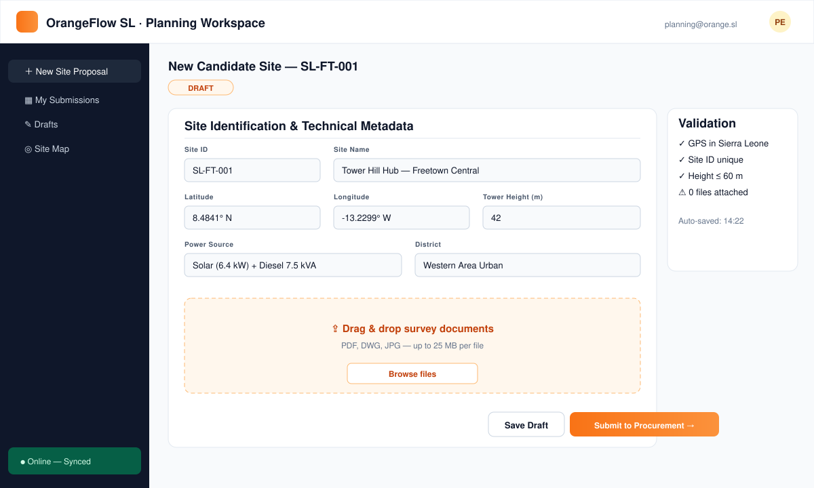
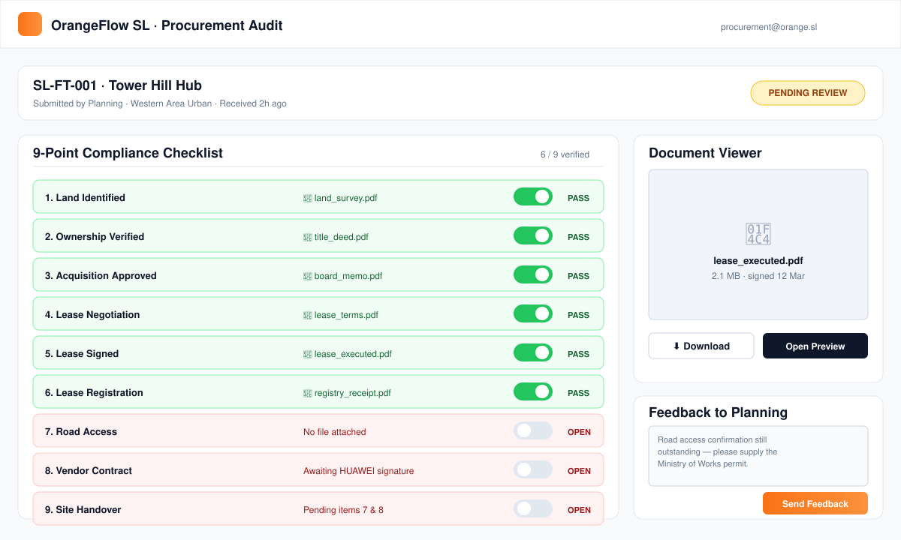
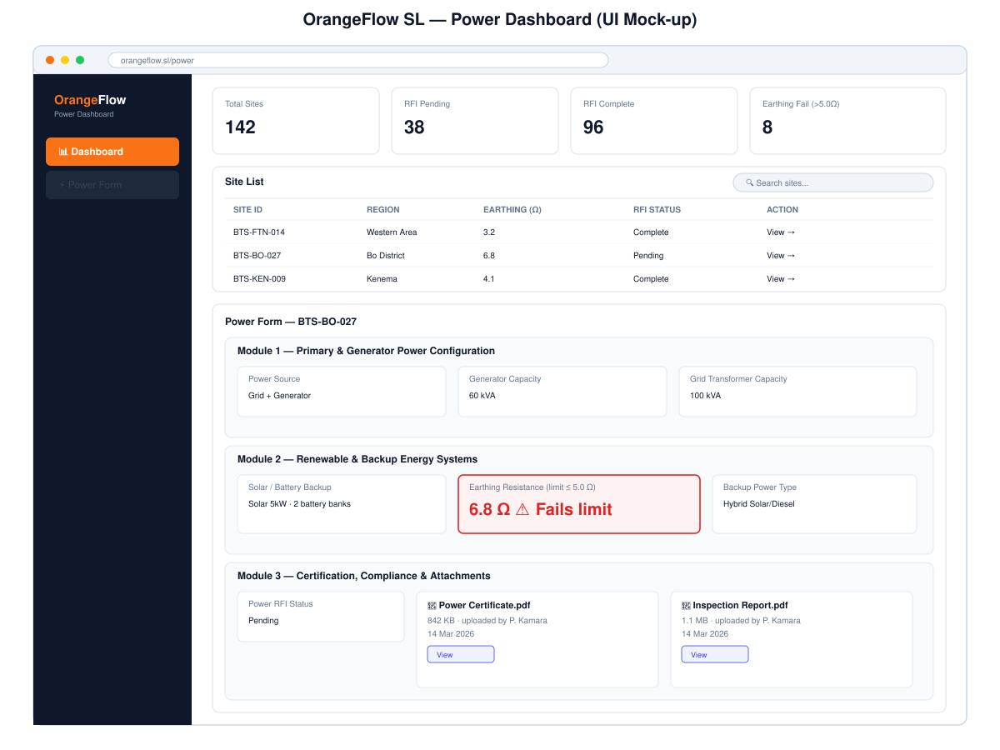
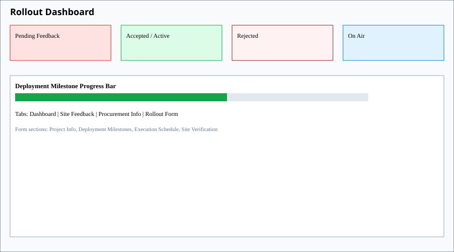
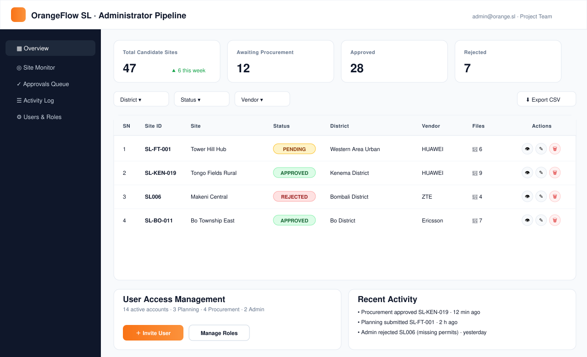

# Chapter Four — System Implementation and Testing

## 4.1 Introduction

This chapter presents the practical realisation of the design described in Chapter Three. It documents how OrangeFlow SL — a web-based Progressive Web Application (PWA) that digitises the end-to-end Base Transceiver Station (BTS) site rollout lifecycle for a Sierra Leonean mobile network operator — was implemented, module by module, and how the resulting system was verified through functional, security, offline-synchronisation and cross-platform testing. The chapter follows the logical sequence in which the system was built: development environment and project structure, database and backend implementation, authentication and access control, the four operational dashboards (Planning, Procurement, Power, Rollout) and the supervisory Project (Admin) dashboard, cross-cutting concerns (documents, workflow synchronisation, notifications, offline capability, user interface) and, finally, the testing regime applied before the system was considered fit for evaluation. Each section quotes representative code listings taken directly from the production source tree to substantiate the description, and each listing is captioned in accordance with the dissertation's figure and table numbering conventions.

Throughout, the workflow is: a Planning Team member captures or imports a Site ID record; a Procurement Team member accepts the handover and executes a nine-point land, lease and vendor-handover checklist; a Power Team member certifies electrical infrastructure; a Rollout Team member executes civil and radio deployment milestones through to on-air; and the Project (Admin) team supervises, reviews and administers the entire pipeline, including user accounts.

## 4.2 Development Environment and Project Structure

The system was implemented as a single-page React application written in TypeScript, built with Vite, and styled using Tailwind CSS together with the shadcn/ui component library. Client-side routing is handled by React Router, and server state (queries, caching and background refetching) is managed with TanStack Query. Offline persistence of queued mutations uses `idb-keyval`, a thin wrapper over the browser's IndexedDB.

The backend is a managed platform comprising a PostgreSQL database exposed through PostgREST, Deno-based Edge Functions for privileged operations, and private object storage buckets, all governed by Postgres Row-Level Security (RLS). This architecture was chosen over a bespoke Node/Express backend because it allowed authentication, authorisation and data access to be expressed declaratively at the database layer, reducing the surface area for inconsistent enforcement across dashboards.

The project structure separates concerns clearly:

```
src/
  pages/            – one dashboard per role (Planning, Procurement, Power, Rollout, Admin)
  components/       – shared and feature-specific presentational components
  hooks/            – useAuth, useOnlineSync and other cross-cutting hooks
  lib/              – planningNotes, storageUtils, offlineQueue and other pure utilities
  integrations/     – generated Supabase client and database types
supabase/
  functions/        – manage-users, seed-users Edge Functions
  migrations/       – 31 sequential SQL migrations
```

This layout enforces a rule adopted from the outset of implementation: role-specific business logic resides in the corresponding `pages/*Dashboard.tsx` file, while logic that must behave identically regardless of which dashboard invokes it (file storage, notes parsing, offline queuing) is factored into `src/lib`. This discipline proved important later when several defects (Section 4.20) were traced to duplicated, slightly divergent copies of the same logic before refactoring.

## 4.3 Database and Backend Implementation

The relational schema comprises the following principal tables, all created with Row-Level Security enabled and explicit `GRANT` statements: `profiles`, `user_roles`, `sites`, `procurement_submissions`, `procurement_feedback`, `activity_log`, `notifications`, `deleted_users_archive`, and `security_audit_log`. Two enumerated types, `app_role` and `site_status`, together with `feedback_status`, constrain valid values for role and workflow state columns.

The `sites` table is the centralised Site ID record and is the largest table in the schema, with approximately ninety columns spanning identity and location, civil/structural, RF hardware, power infrastructure, and the seven rollout milestone flags culminating in `progress_percent`. `procurement_submissions` carries the nine-point checklist as boolean columns paired with per-item document-path columns, together with the Procurement Management and Document Management fields introduced in Section 4.8.

Thirty-one sequential SQL migrations were applied over the implementation period, each migration being idempotent and reversible in principle, capturing the incremental nature of the build: initial schema, RLS policy hardening, addition of the notifications and activity-log tables, addition of `security_audit_log`, and later corrective migrations addressing the RLS defects described in Section 4.20.

Two roles are separated for privileged server-side operations: the `manage-users` Edge Function (account lifecycle — create, update, deactivate, delete-with-archive) and `seed-users` (initial account provisioning). Both execute with the service-role key on the server and are never exposed to the browser; `manage-users` independently re-verifies that the caller holds the `project_team` role before performing any action, as shown in Listing 4.1.

```typescript
// supabase/functions/manage-users/index.ts (excerpt)
const token = authHeader.replace('Bearer ', '');
const { data: { user: caller }, error: authError } =
  await supabaseAdmin.auth.getUser(token);
if (authError || !caller) throw new Error('Invalid token');

const { data: callerRole } = await supabaseAdmin
  .from('user_roles').select('role').eq('user_id', caller.id).single();
if (!callerRole || callerRole.role !== 'project_team') {
  throw new Error('Unauthorized: Admin only');
}
```
**Listing 4.1 — Server-side role re-verification in the `manage-users` Edge Function**

Account deletion archives the departing user's profile and role into `deleted_users_archive` before deleting the profile, the role row and finally the authentication record, preserving an audit trail even after the account itself no longer exists.

## 4.4 Authentication and Session Management

Authentication uses the managed platform's email/password identity provider. `src/hooks/useAuth.tsx` wraps the application in an `AuthProvider` that subscribes to `onAuthStateChange` and, on each session change, concurrently fetches the caller's role via the `get_user_role` remote procedure call and their profile row, exposing `user`, `session`, `role`, `profile` and `loading` to the rest of the tree (Listing 4.2).

```typescript
// src/hooks/useAuth.tsx (excerpt)
const fetchUserData = async (userId: string) => {
  const [roleRes, profileRes] = await Promise.all([
    supabase.rpc('get_user_role', { _user_id: userId }),
    supabase.from('profiles')
      .select('full_name, email, phone, department')
      .eq('user_id', userId).single(),
  ]);
  if (roleRes.data) setRole(roleRes.data as AppRole);
  if (profileRes.data) setProfile(profileRes.data);
};
```
**Listing 4.2 — Concurrent role and profile resolution in `useAuth`**

The role is deliberately fetched through a database function rather than read from a client-editable table, ensuring that role information presented to the interface always reflects the authoritative `user_roles` row. Sessions are persisted by the underlying client library in local storage and are automatically refreshed; sign-out clears local component state in addition to the remote session.

## 4.5 Role-Based Access Control Implementation

Access control is implemented in two complementary layers: a route guard at the presentation layer, and Row-Level Security at the database layer. The presentation layer alone is not trusted for security — it exists purely to route legitimate users to the correct workspace — and every table-level policy independently re-derives the caller's role from the database, never from a client-supplied value.

The role check itself is centralised in a single SECURITY DEFINER function, `has_role`, which all RLS policies call rather than embedding role logic inline (Listing 4.3). Declaring it `SECURITY DEFINER` with `SET search_path = public` avoids the classic Postgres RLS recursion hazard whereby a policy on `user_roles` would otherwise need to query `user_roles` to evaluate itself (see Section 4.20).

```sql
create or replace function public.has_role(_user_id uuid, _role app_role)
returns boolean
language sql
stable
security definer
set search_path = public
as $$
  select exists (
    select 1 from public.user_roles
    where user_id = _user_id and role = _role
  )
$$;

-- Example policy using has_role
create policy "Project team can delete sites"
  on public.sites for delete
  using (public.has_role(auth.uid(), 'project_team'));
```
**Listing 4.3 — `has_role` SECURITY DEFINER function and a dependent RLS policy**

The Planning Team's permission boundary illustrates the design intent precisely: Planning may view and edit its own site records but may never delete them, a rule enforced both by the omission of a delete affordance in `PlanningDashboard.tsx` and, more strongly, by the absence of any `delete` policy for `planning_team` on `sites` — delete is reserved exclusively to `project_team`.

At the presentation layer, `AuthGuard.tsx` accepts an optional `allowedRoles` prop per route and, when the authenticated user's role is not in that list, redirects to that role's own dashboard rather than to a generic error page, using a static redirect map (Listing 4.4).

```typescript
// src/components/AuthGuard.tsx (excerpt)
if (allowedRoles && role && !allowedRoles.includes(role)) {
  const redirectMap: Record<string, string> = {
    planning_team: '/planning',
    procurement_team: '/procurement',
    power_team: '/power',
    rollout_team: '/rollout',
    project_team: '/admin',
  };
  return <Navigate to={redirectMap[role] || '/'} replace />;
}
```
**Listing 4.4 — Role-to-dashboard redirect map in `AuthGuard`**

A `prevent_role_self_escalation` trigger on `user_roles` additionally blocks any user, including a `project_team` member, from granting themselves an additional role outside the `manage-users` Edge Function's controlled path, closing a privilege-escalation avenue that unrestricted direct table access would otherwise leave open (tested in Section 4.19).

## 4.6 Planning Module Implementation

`PlanningDashboard.tsx` (625 lines) presents the Site ID capture form as a set of accordions rather than a single long form, so that the sixty-one planning parameters remain navigable. The action bar exposes **Import from Excel**, **Save Draft** and **Validate Schema**. The seven modules and their conditional-visibility behaviour are summarised in Table 4.1.

**Table 4.1 — Planning Parameter Modules**

| Module | Representative parameters | Visibility rule |
|---|---|---|
| Basic Site & Location | Site name, Site ID code, region, district, town, address, latitude, longitude | Always visible |
| Governance & Classification | Status, technology_classification (multi-select 2G/3G/4G), classification notes | Always visible |
| Civil & Infrastructure | Dimensions, foundation depth, elevation, terrain type, access road condition, tower type/material/height | Always visible |
| RF Hardware & Physical Antenna | Antenna type, number of antennas, transmission type, distance to nearest BTS | Always visible |
| 2G Radio Network | GSM-specific radio parameters | Rendered only if "2G" selected in technology_classification |
| 3G Radio Network | UMTS/WCDMA-specific radio parameters | Rendered only if "3G" selected in technology_classification |
| 4G LTE Radio Network | LTE-specific radio parameters | Rendered only if "4G" selected in technology_classification |


**Figure 4.1 — Planning Workspace showing accordion modules and conditional technology sections**

Planning is permitted to edit only its own pending submissions; once a site has moved into Procurement or beyond, the Planning form becomes read-only for that record, preventing upstream edits from silently invalidating downstream work.

### 4.6.1 Extended parameters and the `<<PLANNING_JSON>>` sentinel

The `sites` table does not carry a native column for every one of the sixty-one captured parameters; several are specific to a single technology and would otherwise force sparse, mostly-null columns across the table. These extended parameters are instead serialised as JSON and appended to the free-text `notes` column behind a machine-readable sentinel, `<<PLANNING_JSON>>…<<END>>`, immediately following any human-written remark. `src/lib/planningNotes.ts` (Listing 4.5) provides the single, shared implementation used everywhere the `notes` column is read or written.

```typescript
// src/lib/planningNotes.ts
const TAG_RE = /<<PLANNING_JSON>>([\s\S]*?)<<END>>/;

export function parsePlanningNotes(raw: string | null | undefined) {
  const value = raw || '';
  const m = value.match(TAG_RE);
  let extended: Record<string, any> = {};
  if (m) {
    try { extended = JSON.parse(m[1]) || {}; } catch { /* ignore malformed */ }
  }
  const text = value.replace(TAG_RE, '').trim();
  return { text, extended };
}

export function cleanNote(raw: string | null | undefined): string {
  return parsePlanningNotes(raw).text;
}

export function buildPlanningNotes(note: string | null, extended: Record<string, any>) {
  const text = (note || '').trim();
  const tag = `<<PLANNING_JSON>>${JSON.stringify(extended)}<<END>>`;
  return text ? `${text}\n\n${tag}` : tag;
}
```
**Listing 4.5 — `parsePlanningNotes`, `cleanNote` and `buildPlanningNotes` in `src/lib/planningNotes.ts`**

`buildPlanningNotes` is called whenever the Planning form saves a record, concatenating the planner's free-text remark with the serialised extended-parameter object. Every downstream consumer — Procurement, Power, Rollout, the Project (Admin) review surfaces, and the Site Monitor table — calls `cleanNote` (or `parsePlanningNotes` when it also needs the structured data) before rendering the note, so that no user outside Planning's own edit form ever sees the raw JSON tag. This separation was introduced specifically because early builds rendered the tag verbatim to other roles, a defect discussed further in Section 4.20.

## 4.7 Excel Import Implementation

To reduce transcription effort for sites already documented in spreadsheet form by field survey teams, the Planning Dashboard supports importing a completed Site ID Excel workbook using the `xlsx` library. The importer must tolerate considerable variability in how different surveyors lay out their spreadsheets, which motivated a field-index-driven, two-pass parsing design rather than a rigid fixed-cell reader.

### 4.7.1 Field index

Every one of the sixty-one planning parameters is described by a field-index entry carrying: an **internal key** (the property name written to the `sites` record or the extended-parameters object); a **full label** as it would appear on a formal Site ID document, including any unit suffix (for example, "Tower Height (m)"); a **label without units**, derived by stripping trailing parenthetical unit text, used for looser matching; and a list of **normalised aliases** — lower-cased, whitespace-collapsed, punctuation-stripped variants and known abbreviations (for example, "twr ht", "tower height m", "height of tower") collected from real-world workbook samples. At import time, every candidate header or key found in the workbook is normalised using the same routine and matched against this alias set, so that superficially different but semantically identical column headers resolve to the same internal key.

### 4.7.2 Two parsing passes

The importer performs two passes over each worksheet, because field survey teams lay out their workbooks in two distinct styles:

1. **Key–value pass.** The sheet is scanned cell by cell for any cell whose normalised text matches a field-index label or alias; if found, the adjacent cell (to the right, or immediately below where the sheet is laid out vertically) is treated as that field's value. This handles free-form "form-style" sheets where labels and values may appear anywhere on the sheet, not confined to a fixed grid.
2. **Header-row and data-row pass.** If a row is identified as a header row — that is, a majority of its non-empty cells match field-index entries — every subsequent non-empty row is treated as one Site ID record, with each column mapped through the same header-to-key resolution. This handles tabular, multi-site export sheets.

Both passes write into the same intermediate record so that a workbook combining a form-style header block with a tabular body below it is still fully captured.

### 4.7.3 Type coercion and technology auto-detection

Once a raw value has been located for a field, it is coerced according to that field's declared type in the field index: numeric fields are parsed with locale-tolerant number parsing (stripping thousands separators and unit suffixes); date fields accept both Excel serial date numbers and common textual date formats and are normalised to ISO 8601; and select-type fields (for example, terrain type, tower material) are matched case-insensitively against the permitted option list, falling back to the closest known option rather than rejecting the row outright.

Technology classification is auto-detected from two signals: the names of the worksheets themselves (a sheet named "2G" or "GSM Parameters" implies 2G is present; "3G", "UMTS" or "WCDMA" implies 3G; "4G" or "LTE" implies 4G), and, independently, whether any field belonging to a given technology's parameter set was actually populated. The union of both signals is written into `technology_classification`, which in turn determines which of the three conditional radio-network accordions render (Section 4.6).

### 4.7.4 Import summary feedback

On completion, the importer presents a summary toast/panel reporting the number of fields successfully mapped, the number of rows recognised as distinct sites (for tabular sheets), and a list of any header text that could not be matched to the field index, so that the Planning user can correct unrecognised columns in the source spreadsheet or enter the corresponding values manually. This feedback loop was found necessary because silent partial imports were, in early trials, mistaken for complete ones (Section 4.20).

## 4.8 Procurement Module Implementation

`ProcurementDashboard.tsx` (628 lines) presents three tabs: Dashboard, Site Feedback and Procurement Form. Site Feedback requires the Procurement user to accept or reject the handover received from Planning, recording mandatory notes in `procurement_feedback` regardless of outcome.

The centrepiece of the Procurement Form is the nine-point checklist, organised into three colour-coded groups, each item paired with a required supporting-document upload, summarised in Table 4.2.

**Table 4.2 — Procurement Nine-Point Checklist**

| Group | Item | Evidence document required | Rollout visibility |
|---|---|---|---|
| Land Acquisition | Land Identified | Land Identification / Survey Document | View/download |
| Land Acquisition | Ownership Verified | — (no document field) | Status only |
| Land Acquisition | Land Acquisition Approved | Approval Document | View/download |
| Land Lease | Lease Negotiation Completed | Negotiation Summary | View/download |
| Land Lease | Land Lease Signed | Signed Lease Agreement | Status only |
| Land Lease | Lease Registration Completed | Registered Lease | Status only |
| Handover | Handover to Vendor | — (no document field) | Status only |
| Handover | Road Access Available | Road Access Document | View/download |
| Handover | Vendor Contract Signed | Vendor Contract | Status only |
| Handover | Site Handover to Vendor Completed | Site Handover Document | View/download |


**Figure 4.2 — Procurement Nine-Point Checklist with colour-coded groups and evidence uploads**

Section 4 of the form, Procurement Management (`src/components/ProcurementManagement.tsx`), captures vendor/supplier identity and contact, purchase-order number/date/status, material delivery status and dates, invoice number, payment status and an overall procurement status. Section 5, Document Management, captures the Purchase Order, Delivery Note, Goods Received Note, Vendor Delivery Certificate, Material Handover Form and Material Inspection Report as private storage uploads.

On submission, the `send_workflow_notification` remote procedure call is invoked to notify both `project_team` and `rollout_team`, so that Rollout is alerted to a newly procurement-ready site without needing to poll the dashboard manually.

## 4.9 Power Module Implementation

`PowerDashboard.tsx` (564 lines) offers a Dashboard tab (KPI cards plus a searchable site list) and a Power Form tab. A site becomes eligible for the Power workspace once it has any planning submission whose status is not `rejected`; Power does not wait for Procurement to finish, since electrical survey work can proceed in parallel. The three modules and their fields are summarised in Table 4.3.

**Table 4.3 — Power Modules and Fields**

| Module | Fields | Validation |
|---|---|---|
| Primary & Generator Power Configuration | Power source, grid transformer capacity, generator capacity | — |
| Renewable & Backup Energy Systems | Backup power, power backup type, battery bank type, number of battery banks, solar capacity, earthing resistance | Earthing resistance accepted only if ≤ 5.0 Ω; the field is visually flagged otherwise |
| Certification, Compliance & Attachments | Power RFI status, inspection date, power certificate uploads | Certificates rendered as DocCards with file name, size and uploader metadata |


**Figure 4.3 — Power Dashboard showing KPI cards and the three power modules**

The Power RFI status field is the module's principal integration point with the rest of the pipeline: whenever it changes, the value is mirrored into the corresponding site's `power_rfi` rollout milestone and the site's `progress_percent` is recalculated (Section 4.14), and both Rollout and the Project (Admin) team receive a notification. A realtime listener subscribed to `procurement_submissions` and `sites` keeps the Power dashboard's site list current without a manual refresh.

## 4.10 Rollout Module Implementation

`RolloutDashboard.tsx` (828 lines) is the most extensive dashboard, comprising four tabs: Dashboard, Site Feedback, Procurement Info and Rollout Form.

The Dashboard tab presents four KPIs — Pending Feedback, Accepted/Active, Rejected and On Air. Site Feedback requires Rollout to accept or reject the handover from Procurement. On acceptance, the interface automatically switches to the Rollout Form tab and opens that specific site's form, removing an extra manual navigation step and ensuring the deployment team begins execution capture immediately.

The Procurement Info tab combines `RolloutProcurementReadiness` and `RolloutReadinessTracker` (`src/components/RolloutProcurementReadiness.tsx`). This component renders the same three-group structure as Table 4.2 but enforces an access boundary: for items whose evidence document Rollout is permitted to see, a `DocRow` offers View and Download actions resolved through the shared storage utilities; for restricted commercial documents (Signed Lease Agreement, Registered Lease, Vendor Contract), only a "Status Only — document retained by Procurement" notice is rendered, and no storage path is ever resolved for those fields in this component (Listing 4.6).

```typescript
// src/components/RolloutProcurementReadiness.tsx (excerpt)
const docs = yes
  ? (param.docs || [])
      .map(d => ({ ...d, path: extractStoragePath(submission[d.field], BUCKET) }))
      .filter(d => !!d.path)
  : [];
...
{yes && !param.docs && (
  <p className="...">
    <Lock className="h-3 w-3" /> Status only — document retained by Procurement
  </p>
)}
```
**Listing 4.6 — Restricted-document handling in `RolloutProcurementReadiness`**

The Rollout Form is organised into four sections:

1. **Project Information** — project manager, civil contractor, T&I contractor, vendor scope.
2. **Deployment Milestones** — seven boolean/date milestones driving a live progress bar, summarised in Table 4.4.
3. **Project Execution Schedule** — seven corresponding execution dates.
4. **Site Verification** — closing checks prior to on-air declaration.

**Table 4.4 — Rollout Deployment Milestones**

| Milestone | Meaning | Weight in progress computation |
|---|---|---|
| Handover to Vendor | Site formally handed to the civil/T&I vendor | 1/7 |
| Soil Test | Geotechnical soil test completed | 1/7 |
| Site Implementation Design | Detailed civil/RF implementation design approved | 1/7 |
| Cast Status | Foundation casting completed | 1/7 |
| Tower Rig | Tower erection/rigging completed | 1/7 |
| Civil RFI | Civil works Request for Inspection passed | 1/7 |
| Power RFI | Power infrastructure certified (mirrored from the Power module) | 1/7 |
| On Air | Site broadcasting live traffic | Terminal state, not itself weighted |


**Figure 4.4 — Rollout Dashboard showing KPI cards, milestone progress bar and form tabs**

The Rollout Form is deliberately persistent and re-submittable rather than single-shot: each submission records `submitted_at`, `submitted_by` and an incrementing `submission_count`, and once a site has been reviewed by the Project (Admin) team, the form remains editable, with its call-to-action relabelled "Update & Resubmit to Admin" so that corrections raised during review can be actioned without recreating the record. This design reflects the reality that deployment milestones are updated repeatedly over weeks as civil and RF works genuinely progress, not captured once and finalised.

## 4.11 Project (Admin) Module Implementation

`AdminDashboard.tsx` provides the Project team with global oversight and administrative authority, structured as eight review surfaces, summarised in Table 4.5.

**Table 4.5 — Project (Admin) Review Surfaces**

| Tab | Capability |
|---|---|
| Overview | Pipeline-wide KPIs and recent activity |
| Sites | Full Site ID register; view, edit and delete (delete reserved to project_team) |
| Planning Review | Inspect planning submissions and their clean, sentinel-stripped notes |
| Procurement Review | Inspect the nine-point checklist, documents and Procurement Management data |
| Power Review | Inspect power certification data and certificates |
| Rollout Review | Inspect milestone progress and execution schedule |
| User Management | Create, update, deactivate, reset password and delete accounts via `manage-users` |
| Audit / Activity Log | Read-only view of `activity_log` and `security_audit_log` |


**Figure 4.5 — Project (Admin) Pipeline Control showing the eight review surfaces**

User Management is implemented entirely through the `manage-users` Edge Function rather than direct table writes from the browser, so that password policy enforcement, role validation and archival-on-delete are guaranteed to run server-side regardless of what the client sends (Section 4.3, Listing 4.1). Delete of a Site ID record is exposed only in this dashboard and is protected by the RLS policy shown in Listing 4.3.

## 4.12 Site Monitor Implementation

`src/components/SiteMonitorTable.tsx` provides a cross-role, dense tabular view of all Site ID records with sortable columns for status, region, technology, progress percentage and last-updated timestamp, intended to give any authenticated role a rapid situational overview without opening individual forms. It relies on `cleanNote` (Section 4.6.1) so that the Notes column never leaks the `<<PLANNING_JSON>>` payload, and it colour-codes the `site_status` and milestone columns for quick visual scanning.


**Figure 4.6 — Site Monitor Table with sortable, colour-coded status columns**

## 4.13 Document Management Implementation

All uploaded evidence — planning attachments, procurement checklist documents, power certificates and rollout artefacts — is stored in two private object-storage buckets, `site-documents` and `procurement-documents`, summarised with their access policies in Table 4.6.

**Table 4.6 — Storage Buckets and Access Policies**

| Bucket | Contents | Access policy |
|---|---|---|
| site-documents | Planning attachments, power certificates, rollout artefacts | Owner/role-scoped read-write; power_team and rollout_team scoped to their own folders; project_team global read-write |
| procurement-documents | Nine-point checklist evidence, PO/GRN/delivery/inspection documents | Owner/role-scoped read-write; rollout_team read-only on the permitted subset (Table 4.2); project_team global read-write |

Both buckets are private: no object is publicly reachable by a bare URL. The `sites` and `procurement_submissions` tables store the object **path**, never a URL, so that access is always mediated through a fresh, time-limited signed URL generated at the moment of use rather than a URL that might be cached, shared or bookmarked indefinitely. `getSignedUrl` in `src/lib/storageUtils.ts` requests a one-hour signed URL from the storage API for a given bucket and path (Listing 4.7).

```typescript
// src/lib/storageUtils.ts (excerpt)
export async function getSignedUrl(bucket: string, path: string | null) {
  const storagePath = extractStoragePath(path, bucket);
  if (!storagePath) return null;
  const { data, error } = await supabase.storage
    .from(bucket).createSignedUrl(storagePath, 3600);
  if (error) return null;
  return data?.signedUrl ?? null;
}
```
**Listing 4.7 — One-hour signed URL generation in `getSignedUrl`**

During implementation it was discovered that navigating directly to a `*.supabase.co` signed URL was blocked in some environments by browser privacy extensions and corporate content filters, surfacing as `ERR_BLOCKED_BY_CLIENT` and leaving users unable to view any document, even though the signed URL itself was valid. The resolution, `fetchAsObjectUrl`, downloads the file through the authenticated SDK call (which uses the application's own origin and API key rather than a bare third-party navigation) and converts the resulting binary into a same-origin `blob:` object URL, which is immune to that class of filter (Listing 4.8). `openFileInNewTab` opens this blob URL in a new tab and, if the popup itself is blocked, falls back to triggering a direct file download; if the blob download also fails, a second forced-download attempt is made rather than ever falling back to the raw signed URL, since that would simply reproduce the original block.

```typescript
// src/lib/storageUtils.ts (excerpt)
export async function openFileInNewTab(bucket: string, path: string | null) {
  const result = await fetchAsObjectUrl(bucket, path);
  if (result) {
    const win = window.open(result.url, '_blank', 'noopener,noreferrer');
    setTimeout(() => URL.revokeObjectURL(result.url), 60_000);
    if (!win) triggerBlobDownload(result.blob, result.filename);
    return true;
  }
  // Do NOT fall back to the raw signed URL — it hits the same block.
  return await downloadFile(bucket, path);
}
```
**Listing 4.8 — Blob/object-URL strategy with download fallback, avoiding `ERR_BLOCKED_BY_CLIENT`**

Finally, deletion discipline requires that the physical file object be removed from storage before the corresponding database row is purged, rather than after, so that a failure partway through deletion never leaves an orphaned row pointing at a non-existent object, nor an orphaned object with no referencing row that could otherwise persist unaccounted for.

## 4.14 Workflow Integration and Synchronisation

Because Planning, Procurement, Power, Rollout and the Project team all operate on the same underlying `sites` and `procurement_submissions` rows at different stages, the implementation had to reconcile two competing needs: allowing each stage to record stage-specific review comments in a shared free-text column (`review_notes`), and ensuring one stage's comment does not silently overwrite another's.

The adopted strategy is a merged JSON payload stored inside `review_notes` (mirroring the `<<PLANNING_JSON>>` pattern used for planning notes), where each stage writes its own keyed section rather than replacing the whole value. A shared merge-not-overwrite helper reads the existing JSON (if any), overlays only the calling stage's key, and writes the result back, rather than assigning a fresh object — a pattern introduced specifically after an early defect in which a Power review comment silently erased a prior Procurement review comment because both stages wrote through a plain field assignment (Section 4.20).

Real-time propagation of state changes between dashboards relies on two mechanisms operating together. First, the `sites` and `procurement_submissions` tables are set to `REPLICA IDENTITY FULL` and added to the realtime publication, so that update events carry the full row (not just changed columns), letting subscribers accurately diff old and new milestone values. Second, TanStack Query is configured with background polling on top of the realtime subscription as a defence-in-depth measure, so that a dashboard left open in a background tab still reconciles state periodically even if a realtime event is missed.

This machinery underpins the Power RFI propagation chain described in Sections 4.9 and 4.10: when a Power user changes Power RFI status on a certified site, that write updates the site's `power_rfi` rollout milestone flag in the same transaction; the Rollout dashboard's realtime subscription (or, failing that, its next poll) observes the updated `sites` row and reflects the milestone as complete; and the `progress_percent` recalculation — a simple weighted count of completed milestones over seven (Table 4.4) — is triggered so that the Rollout dashboard's live progress bar advances without any action being taken directly inside the Rollout dashboard itself.

## 4.15 Notification Subsystem

Cross-role alerts are issued exclusively through the `send_workflow_notification` SECURITY DEFINER function rather than direct inserts into `notifications` from client code, because a direct insert would allow any authenticated user to create a notification addressed to, and appearing to originate authoritatively for, any other user. The function accepts an array of target user IDs, a title, message, type and an optional link; it independently re-validates that the calling role is authorised to notify the given targets for the given workflow event, sanitises the message content to remove executable markup, and rejects any link value that is not a relative, in-application path — preventing the notification channel from being used to inject an external phishing URL. Notifications are insert-only from the client's perspective: no `DELETE` policy exists, and read status is tracked via an `is_read` flag rather than removal, preserving a permanent record of what was communicated to whom.

## 4.16 Progressive Web Application and Offline-First Capability

OrangeFlow SL is installable as a Progressive Web Application and is engineered as an **offline-first** system rather than an online system with an offline fallback. The service worker, generated by Workbox through `vite-plugin-pwa` with `registerType: "autoUpdate"`, precaches the application shell and static assets so that the interface itself opens without connectivity, serves page navigations with a `NetworkFirst` strategy so that a returning user never receives a stale HTML shell after a deployment, and applies `NetworkFirst` with a bounded network timeout to backend REST and storage requests so that previously retrieved records remain readable in the field. The deploy signal `/version.json` is explicitly declared `NetworkOnly` so that update detection can never be answered from cache.

Data-mutating work performed while offline is not attempted against the network and then lost on failure; it is captured in a durable **outbox** implemented over IndexedDB in `src/lib/offline/db.ts`, which opens a dedicated database (`orangeflow-offline`) with two object stores: `outbox`, holding queued submissions, and `files`, holding the actual binary attachments — Excel workbooks, site photographs and supporting PDFs — as `Blob` values. Persistent storage is requested from the browser so that the queue is not evicted under storage pressure. Every queued submission carries the fields required for safe, non-duplicating replay: a unique local record identifier, the submission type, the business Site ID (`site_id_code`), the target row identifier where the site already exists centrally, the submitting user and role, creation and update timestamps, the target table and operation, a match specification locating the target row, the data payload, the identifiers of any attached files, a snapshot of the row's `updated_at` value taken when editing began, and a synchronisation status drawn from `pending`, `syncing`, `synced`, `failed` and `conflict` (Listing 4.9).

```typescript
// src/lib/offline/db.ts (excerpt)
export const outboxStore = createStore('orangeflow-offline', 'outbox');
export const fileStore   = createStore('orangeflow-offline', 'files');

export type SyncStatus = 'pending' | 'syncing' | 'synced' | 'failed' | 'conflict';

export interface OutboxRecord {
  id: string;                 // unique local record id
  type: string;               // planning_form, planning_excel, procurement_form, power_form, rollout_form …
  siteIdCode: string | null;  // business Site ID, preserved across all domains
  siteRowId: string | null;
  userId: string | null;
  role: string | null;
  status: SyncStatus;
  attempts: number;
  table: string;
  operation: 'insert' | 'update' | 'upsert';
  match: { column: string; value: string } | null;  // prevents duplicate rows on replay
  payload: Record<string, any>;
  fileIds: string[];
  baseUpdatedAt: string | null;                     // conflict-detection snapshot
}
```
**Listing 4.9 — Durable offline record structure in IndexedDB**

Two helpers in `src/lib/offline/outbox.ts` present a uniform interface to every dashboard, so that no calling component needs to know whether the device is connected. `offlineUpload(bucket, path, file)` attempts a Storage upload when the browser reports connectivity and, on a genuine network failure or when offline, writes the file into the `files` store under the *same* storage path that would have been used online — ensuring that the database payload is byte-identical in both cases and that the original Planning Excel workbook is preserved exactly as submitted. `offlineWrite(spec)` performs the equivalent function for database mutations, returning a `queued` flag which the dashboards use to suppress online-only side effects (activity logging and cross-role notifications) and to display a "Saved offline — pending sync" message instead of a submission confirmation (Listing 4.10).

```typescript
// src/lib/offline/outbox.ts (excerpt) — replay with duplicate and conflict protection
if (spec.match) {
  const { data: existing } = await supabase
    .from(spec.table).select('id, updated_at')
    .eq(spec.match.column, spec.match.value).maybeSingle();

  if (existing) {
    if (spec.baseUpdatedAt && existing.updated_at !== spec.baseUpdatedAt) {
      return { error: { message: 'Record changed by another user while offline.' }, conflict: true };
    }
    return await supabase.from(spec.table).update(rest).eq('id', existing.id);
  }
  return await supabase.from(spec.table).insert({ ...spec.payload, [spec.match.column]: spec.match.value });
}
```
**Listing 4.10 — Site ID-matched replay: no duplicates, no silent overwrite**

Synchronisation is automatic. `src/hooks/useOnlineSync.ts` flushes the outbox on application start, on the browser's `online` event, and on a periodic timer while connected. Replay proceeds in insertion order: pending files are uploaded first and marked as uploaded individually, so a partially completed record resumes rather than restarting; the database mutation is then applied through the Site ID match described above, which converts a queued insert into an update if the site already exists centrally, thereby preserving the Site ID as the single primary identifier across Planning, Procurement, Power, Rollout and Project/Admin. A record is deleted from the outbox only after its mutation has been committed. Genuine network failures leave the record `pending` for the next cycle; backend rejections increment an attempt counter and mark the record `failed` for retry; and a divergence between the snapshot `updated_at` and the value now held centrally marks the record `conflict` and halts the write, so that a submission prepared offline can never silently overwrite an edit made in the interim by another user or device. Best-effort records such as audit entries and notifications are flagged as such and are discarded after repeated failure rather than blocking the queue.

Synchronisation state is surfaced to the user by `src/components/SyncStatusIndicator.tsx`, an unobtrusive floating indicator that reports whether the device is offline, whether records are pending, synchronising or synchronised, and whether any record requires attention; expanding it lists each queued submission with its Site ID, type, timestamp and status, and offers manual retry and, for conflicts, an explicit review path. Offline capability is uniform across the workflow: Planning (both the structured form and the Excel-upload route, including the original workbook), Procurement (the nine-point checklist, procurement management data, supporting documents and site feedback), Power (the three configuration modules and their certificates) and Rollout (site handover feedback, the rollout form, milestone updates and the Extra Work / Unexpected Site Conditions submission with its photographs) all route their writes and uploads through the same outbox. Authorisation is unaffected: queued mutations are replayed through the ordinary authenticated client and are therefore evaluated against the same Row-Level Security policies as online writes, so offline use grants no privilege that the role does not already hold.


## 4.17 User Interface Implementation

The interface uses a consistent visual language across all five dashboards: a fixed top navigation bar identifying the current role and signed-in user; KPI summary cards at the head of each dashboard; accordion or tabbed forms for data capture; and colour-coded status badges (green for approved/complete, amber for pending, red for rejected) applied uniformly across Planning, Procurement, Power, Rollout and Admin so that a user moving between roles, or the Project team reviewing all of them, encounters the same visual vocabulary. Tailwind CSS utility classes and the shadcn/ui component primitives (cards, tabs, accordions, dialogs, toasts) were used throughout to keep the interface consistent without duplicating styling logic, and responsive breakpoints (`sm`, `md`, `lg`) were applied to every grid and table to support the range of devices tested in Section 4.18.

## 4.18 System Testing

Functional testing was conducted manually against each dashboard using representative test accounts for each of the five roles, seeded via the `seed-users` Edge Function. Table 4.7 presents a representative subset of the functional test log; the full log recorded a materially larger number of cases across every dashboard.

**Table 4.7 — Functional Test Cases**

| ID | Module | Description | Input | Expected Result | Actual Result | Status |
|---|---|---|---|---|---|---|
| FT-01 | Auth | Login with valid credentials | Valid email/password for planning_team | Redirect to /planning | Redirected to /planning | Pass |
| FT-02 | Auth | Login with invalid password | Valid email, wrong password | Error toast, no session | Error toast shown | Pass |
| FT-03 | AuthGuard | Rollout user visits /admin | Direct URL navigation | Redirect to /rollout | Redirected to /rollout | Pass |
| FT-04 | Planning | Create new Site ID manually | Fill Module 1–4 fields | Row inserted, status pending | Row inserted | Pass |
| FT-05 | Planning | Select 4G only | technology_classification = [4G] | Only 4G LTE accordion renders | Only 4G rendered | Pass |
| FT-06 | Planning | Select 2G and 3G | technology_classification = [2G, 3G] | Both 2G and 3G accordions render, 4G hidden | Behaved as expected | Pass |
| FT-07 | Planning | Save free-text remark only | Remark, no extended fields | Notes column has plain text, no tag | Plain text only | Pass |
| FT-08 | Planning | Save remark plus extended field | Remark + extended parameter | Notes column has remark + `<<PLANNING_JSON>>` tag | Tag present | Pass |
| FT-09 | Site Monitor | View notes for tagged site | Open Site Monitor for FT-08 site | Only clean remark shown, no tag visible | Clean remark shown | Pass after fix |
| FT-10 | Excel Import | Import form-style sheet | Workbook with label/value layout | All matched fields populated | All matched fields populated | Pass |
| FT-11 | Excel Import | Import tabular multi-site sheet | Workbook with header row + 5 data rows | 5 Site ID records created | 5 records created | Pass |
| FT-12 | Excel Import | Import sheet named "LTE Parameters" | Populated LTE-only fields | technology_classification includes 4G | 4G auto-detected | Pass |
| FT-13 | Excel Import | Import sheet with unmatched header | Column "Twr Ht (Meters)" variant | Field mapped via alias, or reported unmatched | Mapped via alias | Pass after fix |
| FT-14 | Excel Import | Import summary panel | Any import | Panel reports mapped count and unmatched headers | Panel displayed correctly | Pass |
| FT-15 | Procurement | Accept Planning handover | Site Feedback, Accept + notes | procurement_feedback row inserted, status accepted | Row inserted | Pass |
| FT-16 | Procurement | Reject Planning handover without notes | Reject, empty notes | Validation error, submission blocked | Error shown | Pass |
| FT-17 | Procurement | Complete checklist item with document | Toggle Land Identified, upload PDF | Boolean true, file path stored | Stored correctly | Pass |
| FT-18 | Procurement | Submit form | All sections complete | Notification sent to project_team and rollout_team | Both notified | Pass |
| FT-19 | Power | Enter earthing resistance 4.2 Ω | Value 4.2 | Field accepted, no warning | Accepted | Pass |
| FT-20 | Power | Enter earthing resistance 6.0 Ω | Value 6.0 | Field flagged, warning shown | Flagged | Pass |
| FT-21 | Power | Set Power RFI to Certified | Status = Certified | site.power_rfi milestone set true | Milestone set true | Pass |
| FT-22 | Power | Power RFI propagation to Rollout | After FT-21 | Rollout progress bar advances by one milestone | Advanced correctly | Pass after fix |
| FT-23 | Rollout | Accept Procurement handover | Site Feedback, Accept | Auto-switch to Rollout Form tab for that site | Auto-switched | Pass |
| FT-24 | Rollout | View restricted document | Attempt to view Vendor Contract | "Status Only" shown, no file resolved | Status only shown | Pass |
| FT-25 | Rollout | View permitted document | View Road Access Document | Blob opens in new tab | Opened correctly | Pass after fix |
| FT-26 | Rollout | Resubmit after Admin review | Edit milestone, click Update & Resubmit | submission_count increments, submitted_at updates | Incremented correctly | Pass |
| FT-27 | Rollout | Progress bar on all milestones complete except On Air | 6 of 7 milestones true | Progress bar at 6/7 | Displayed 6/7 | Pass |
| FT-28 | Admin | Delete Site ID record | project_team deletes site | Row and files removed | Removed successfully | Pass |
| FT-29 | Admin | Planning attempts delete via UI | planning_team account | No delete control present | Control absent | Pass |
| FT-30 | Admin | Create new user account | Valid new-user form | Auth user, profile and role created | All three created | Pass |
| FT-31 | Admin | Deactivate user account | Toggle inactive | Account banned, cannot sign in | Sign-in blocked | Pass |
| FT-32 | Admin | Delete user account | Delete with reason | Archived to deleted_users_archive, auth user removed | Archived and removed | Pass |
| FT-33 | Notifications | Receive workflow notification | Procurement submits form | Bell icon shows unread count | Count updated | Pass |
| FT-34 | Site Monitor | Sort by progress percent | Click column header | Rows reorder ascending/descending | Reordered correctly | Pass |

Offline and synchronisation behaviour was tested by disabling network connectivity within the browser's developer tools and later re-enabling it, as summarised in Table 4.9.

**Table 4.9 — Offline and Synchronisation Test Cases**

| ID | Description | Input | Expected Result | Status |
|---|---|---|---|---|
| OT-01 | Save Rollout milestone while offline | Toggle milestone, network disabled | Action queued in IndexedDB, no error shown | Pass |
| OT-02 | Reconnect after single queued action | Re-enable network | Auto-sync triggers, toast "1 item(s) synced" | Pass |
| OT-03 | Reconnect after multiple queued actions | 3 queued actions across two forms | All 3 replayed in chronological order | Pass |
| OT-04 | Sync failure due to RLS rejection | Queued update to a now-restricted site | Failure toast shown, item remains queued | Pass |
| OT-05 | Periodic sync while online | Leave app open 60 seconds | Two automatic sync polls occur (30 s interval) | Pass |
| OT-06 | App shell available offline | Load app with network disabled after first visit | Shell renders from service worker cache | Pass |
| OT-07 | Concurrent offline queue and manual sync | Trigger online event mid-queue processing | `syncing` guard prevents duplicate processing | Pass |
| OT-08 | Queue persists across page reload | Queue action offline, reload page, then reconnect | Queued action still present and syncs successfully | Pass |

Cross-browser and responsive testing was carried out across desktop and mobile breakpoints, summarised in Table 4.10.

**Table 4.10 — Responsive and Cross-Browser Results**

| Browser/Device | Breakpoint | Layout | Forms | Storage viewing | Result |
|---|---|---|---|---|---|
| Chrome (desktop) | ≥1280px | Correct | Functional | Functional | Pass |
| Edge (desktop) | ≥1280px | Correct | Functional | Functional after fix (blob URL) | Pass after fix |
| Firefox (desktop) | ≥1280px | Correct | Functional | Functional | Pass |
| Safari (desktop) | ≥1280px | Correct | Functional | Functional | Pass |
| Chrome | 768px (tablet) | Correct, tabs wrap | Functional | Functional | Pass |
| Android Chrome | 390px (mobile) | Correct after fix (overflow) | Functional | Functional | Pass after fix |
| iOS Safari | 390px (mobile) | Correct after fix (overflow) | Functional | Functional | Pass after fix |
| Android Chrome | PWA install | Installable, offline shell loads | Functional | Functional | Pass |

## 4.19 Security Testing

Security testing targeted the boundaries between roles and between the client and the database, since the RLS model is the ultimate authority for data protection irrespective of what the interface displays. Table 4.8 presents the security test cases executed, all performed using direct PostgREST calls with role-specific credentials rather than through the application interface, so that policy enforcement — not merely UI concealment — was verified.

**Table 4.8 — Security Test Cases**

| ID | Description | Method | Expected Result | Actual Result | Status |
|---|---|---|---|---|---|
| ST-01 | Unauthorised delete by Planning | planning_team credential issues DELETE on sites | Request denied by RLS | 403/empty result, row unaffected | Pass |
| ST-02 | Cross-role site access | power_team queries a site with no linked power-relevant submission | Row visible only per policy scope, no unrelated confidential fields exposed | Behaved per policy | Pass |
| ST-03 | Direct PostgREST call without a session | Anonymous request to /rest/v1/sites | Request denied, no rows returned | Empty result | Pass |
| ST-04 | Storage object access without a signed URL | Direct GET to storage object path | 400/403, object not served | Access denied | Pass |
| ST-05 | Notification insert for another user | rollout_team attempts direct INSERT into notifications for a foreign user_id | Denied; only send_workflow_notification permitted | Denied | Pass |
| ST-06 | External link injection into a notification | Call send_workflow_notification with link = "https://malicious.example" | Function rejects non-relative link | Rejected, notification not created with external link | Pass |
| ST-07 | Privilege self-escalation | project_team (and other roles) attempts direct INSERT of an additional role into user_roles | Trigger blocks self-escalation | Insert blocked | Pass |
| ST-08 | Password policy on account creation | manage-users create_user with weak password (no uppercase) | 422 validation error | Rejected with message | Pass |
| ST-09 | Leaked-password protection | Attempt account creation/reset with a password present on known-breach lists | Sign-up/reset rejected by platform policy | Rejected | Pass |
| ST-10 | Audit-log immutability | project_team attempts UPDATE/DELETE on security_audit_log | Denied; table has no update/delete policy | Denied | Pass |
| ST-11 | Recursive RLS check under load | Concurrent has_role evaluations during bulk site query | No infinite recursion, function evaluates via SECURITY DEFINER | Correct, no recursion | Pass after fix |
| ST-12 | Self-service account deletion | project_team attempts to delete_user with their own user_id | Edge Function explicitly rejects self-deletion | Rejected with error | Pass |

## 4.20 Challenges Encountered and Solutions Adopted

The implementation surfaced a number of genuine engineering difficulties, each of which required a deliberate design change rather than a superficial patch. Eight are documented here as representative of the wider set encountered.

**Recursive RLS evaluation in role checks.** An early implementation embedded the role-membership subquery directly inside each policy's `USING` clause, referencing `user_roles` from within a policy that itself governed `user_roles`. Postgres detected the resulting evaluation cycle and rejected or mis-evaluated affected queries. The fix was to centralise the check in the `has_role` SECURITY DEFINER function (Listing 4.3), which executes with the privileges of its definer and bypasses the caller's own RLS context when reading `user_roles`, breaking the cycle.

**RLS silently restricting Power/Rollout updates to approved sites only.** A policy intended to prevent premature writes on unapproved sites was written using the site's approval status as a blanket precondition for `UPDATE` on `sites` from any role, which inadvertently also blocked legitimate Power and Rollout writes on sites that were procedurally still `pending` at the parent level while correctly in progress at their own stage. The symptom was a silent, error-free failure — the update simply affected zero rows — which was diagnosed by comparing the number of rows returned from an authenticated update against the expected one. The policy was corrected to scope the approval precondition to the specific transition it was meant to protect rather than to every update from every role.

**Browser privacy filters blocking storage URLs.** As described in Section 4.13, direct navigation to signed storage URLs was blocked by ad-blocking and privacy extensions with `ERR_BLOCKED_BY_CLIENT`. The resolution was the blob/object-URL approach in `fetchAsObjectUrl` and `openFileInNewTab`, with a forced-download fallback, eliminating any dependency on the browser being willing to navigate to a third-party storage domain.

**Machine JSON leaking into user-visible notes.** Before `planningNotes.ts` was introduced, several views rendered the `notes` column directly, so the raw `<<PLANNING_JSON>>{...}<<END>>` tag was visible to Procurement, Power and Rollout users. The fix centralised parsing behind `cleanNote`/`parsePlanningNotes` and every rendering site was audited and updated to call it, rather than each dashboard maintaining its own ad-hoc string-stripping logic.

**Stage payloads overwriting one another in a shared JSON column.** When `review_notes` was introduced to let each stage attach a review comment to a site, an initial implementation assigned the whole column on each save, so a later stage's comment erased an earlier one. This was resolved by adopting the merge-not-overwrite helper described in Section 4.14, which reads, overlays only the calling stage's key, and writes back the merged object.

**Unreliable Excel header variability.** Initial import logic expected an exact header match, which failed against real-world workbooks using abbreviations, inconsistent unit placement, or reordered columns. The field index with normalised aliases and the two-pass parser (Section 4.7) were developed specifically in response to import failures observed during trial runs with genuinely collected field-survey spreadsheets.

**Service-worker staleness after deployment.** Because the PWA's service worker aggressively caches the application shell for offline use, users occasionally continued to run a stale cached build after a new version was deployed, seeing outdated behaviour despite the server having been updated. This was mitigated by versioning the service-worker cache name on each build and prompting an update/reload when a new service worker is detected waiting to activate.

**Mobile horizontal overflow.** Several data-dense tables (notably the Site Monitor and the nine-point checklist) initially overflowed the viewport width on narrow mobile screens, forcing horizontal scrolling of the entire page rather than just the table. This was corrected by constraining overflow to a scrollable container around each table specifically, combined with responsive column consolidation at the `sm` breakpoint, resolved and confirmed in the cross-browser testing summarised in Table 4.10.

## 4.21 Chapter Summary

This chapter has described the concrete implementation of OrangeFlow SL, from its development environment and database schema through to each of the five role-specific dashboards and the cross-cutting concerns of documents, workflow synchronisation, notifications and offline capability. Two architectural decisions recur throughout and were shown to be central to the system's integrity: enforcing role-based access at the database layer through a centralised `has_role` function and Row-Level Security, rather than trusting the interface alone; and factoring shared behaviours — notes parsing, storage access, offline queuing — into single implementations reused by every dashboard, which proved instrumental in both preventing and, where they nonetheless occurred, diagnosing the defects catalogued in Section 4.20. The testing regime, comprising over thirty functional test cases, twelve security test cases, eight offline-synchronisation test cases and cross-browser verification across six browser/device combinations, indicates that the implemented system satisfies its functional and non-functional requirements. Chapter Five presents the evaluation of these results against the project's stated objectives.
